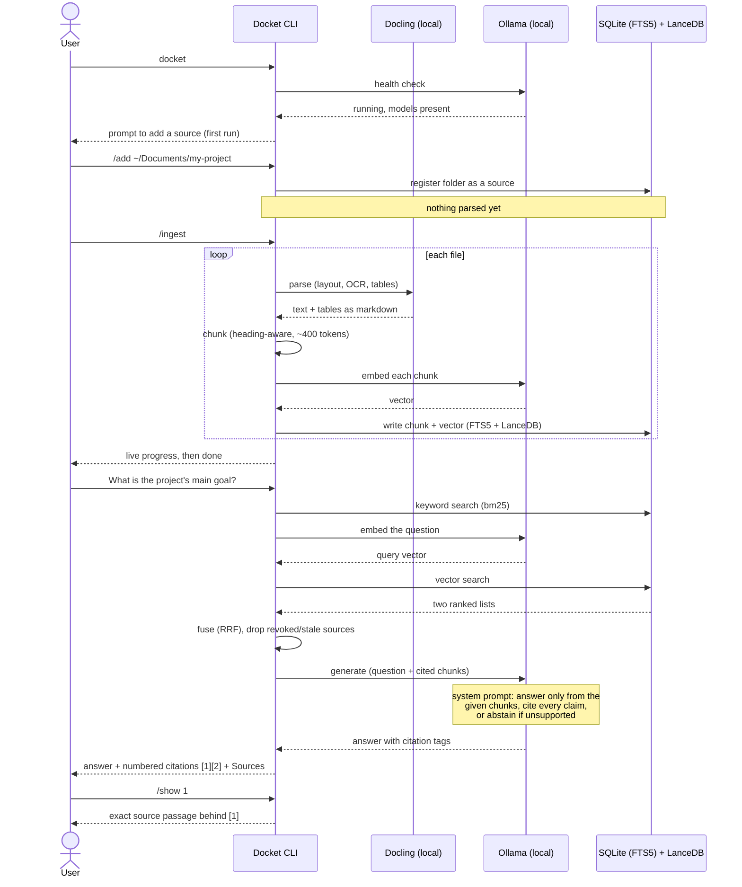

# Docket — one interactive session, sequence diagram

Internal reference: what actually happens, in order, for a single session —
from typing `docket` to getting a cited answer. Based on the real code
(`cli/main.py`, `cli/interactive/session.py`, `sources/manager.py`,
`ingestion/pipeline.py`, `query/service.py`, `retrieval/hybrid.py`).

Renders as a real diagram in GitHub, VS Code (Markdown preview), or any
Mermaid-aware viewer.

## What matters about this flow

- **Nothing leaves the machine.** Parsing, embedding, retrieval, and
  generation are all local (Docling + Ollama). No API keys, no cloud calls.
- **Ingestion and question-answering are separate steps.** `/ingest` has to
  run (once, then incrementally on changes) before questions can be
  answered — Docket never reads files live off disk to answer a question.
- **Retrieval always runs both search types and fuses them**, not one or
  the other — that's what "hybrid" means here.
- **Abstention is designed behavior, not a bug**: if the retrieved chunks
  don't actually support an answer, the system prompt tells the model to
  say so rather than guess.
- **`/show n`** exists specifically so an answer's citation can be checked
  against the real source text, not just trusted.
