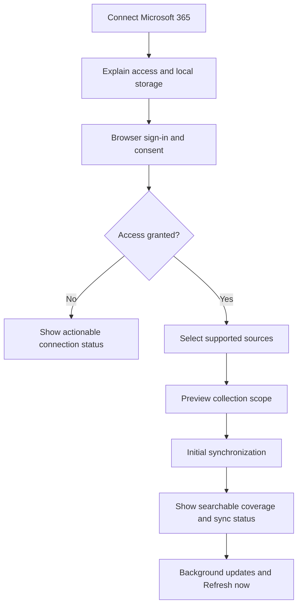
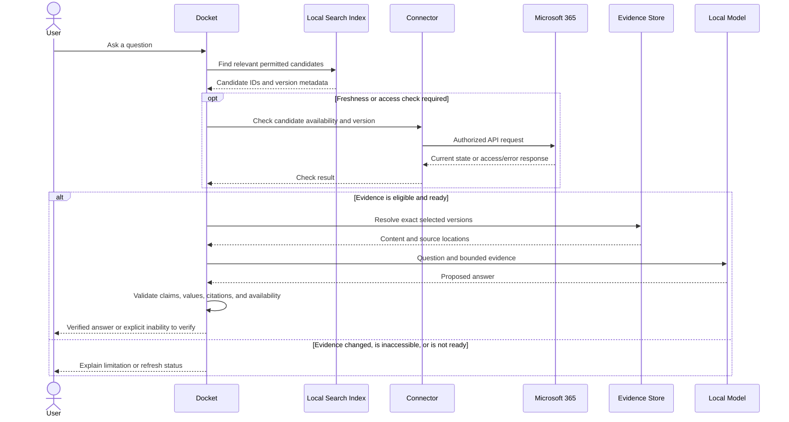
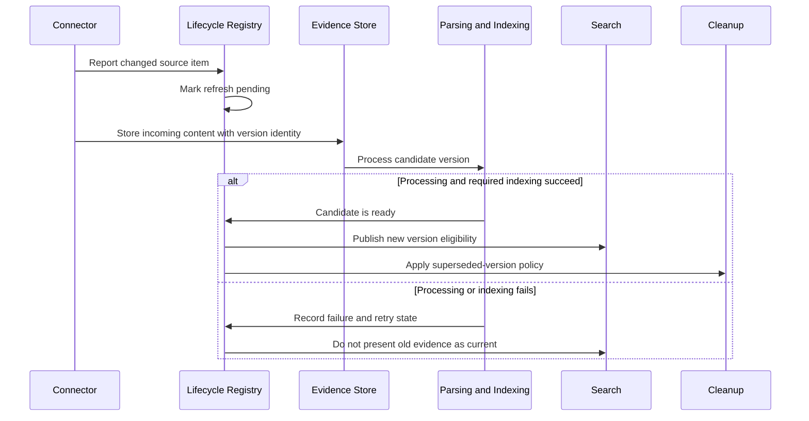

# Sources and Lifecycle

Status: Requirements agreed; implementation approach pending validation.

This document records the source-lifecycle decisions for Docket. It distinguishes accepted product behavior from technical choices that still require research and testing.

## 1. Purpose and scope

Docket should gather authorized evidence from documents and conversations, then retrieve the material needed for a particular question.

Initial connected sources:

- Microsoft 365 company email.
- Microsoft Teams conversations.
- OneDrive and SharePoint files.
- Existing local-file ingestion remains supported.

Gmail is outside the current upgrade scope. Exact Teams coverage—chats, channels, and meeting transcripts—requires endpoint and permission validation.

Source type does not automatically determine authority. A spreadsheet may contain the exact answer to a revenue question, while emails and Teams discussions may explain the reasons behind a change.

### Example: exact revenue lookup

For “What was August’s revenue in FY 2025–26?”, Docket should:

1. Locate the relevant workbook.
2. Identify the correct financial year, sheet, month, and revenue field.
3. Retrieve the exact value, including currency and units.
4. Cite the workbook version and cell or range.
5. Ask for clarification if multiple interpretations remain.

The LLM must not invent or estimate a value already available in the evidence. Spreadsheet extraction belongs to the parsing design; this lifecycle must preserve the source and version needed to verify it.

## 2. Current implementation

The existing backend:

- Registers local folders.
- Ingests PDF and DOCX files.
- Stores content-addressed original bytes and evidence-version records.
- Tracks current versions by source and file path.
- Provides an explicit watcher that re-runs folder ingestion.
- Revokes sources without deleting their stored data.
- Restricts evidence resolution to active sources and current versions.

Microsoft 365 connectors, guided account consent, bounded retention, and spreadsheet ingestion are proposed upgrades.

The current ingestion path also needs explicit handling for disappeared files and partial indexing failures.

## 3. Connection and source selection

The user-facing connection flow should:

1. Explain supported services and the read access needed.
2. Explain that selected content will be stored and indexed locally.
3. Open Microsoft sign-in and consent in the browser.
4. Report organizational approval requirements when applicable.
5. Let the user select sources before content ingestion.
6. Show connection, synchronization, and storage status.

Read-only delegated access is the preferred model. Docket must enforce the user’s selected collection boundaries separately from the permissions Microsoft grants.

Using Outlook on the web does not establish whether a custom integration is permitted. A local Outlook installation is not a prerequisite for the proposed API integration.

MCP is an option for exposing connector tools. It does not replace Microsoft authorization or solve synchronization, indexing, or retention.

## 4. Synchronization and question-time access

The preferred approach combines:

- Background synchronization of selected sources.
- A local searchable evidence collection.
- A manual **Refresh now** action.
- Selective live checks for freshness and access.

It should not browse through every email for each question.

Each connector must support reliable progress tracking and recovery from interrupted synchronization. Incremental APIs should be used where available, with reconciliation to recover missed or inconsistent state.

Synchronization does not guarantee immediate visibility of every upstream change. Answers must distinguish:

- Latest successfully synchronized evidence.
- Evidence checked online for the current request.
- Evidence whose freshness could not be verified.

When an online check fails, Docket must not claim that cached information is current. Cached use depends on the eventual access and offline-use policy. Confirmed access loss blocks the affected evidence.

The specific validation mechanisms will be designed in the parsing, retrieval, and trust documents. Citation syntax alone is not evidence of factual support.

## 5. Version policy and consistent updates

**Keep the latest successfully synchronized version by default.** Historical retention is optional for selected collections and must be bounded.

“Latest version” means the latest saved contents of the same source item. It does not mean keeping only the newest file.

For example:

- A correction to `Revenue-FY2025-26.xlsx` supersedes its earlier contents.
- `Revenue-FY2024-25.xlsx` remains a separate relevant document.
- An old email remains relevant if it belongs to the selected collection.

When a change is detected:

- Mark the existing evidence as pending refresh for current-answer purposes.
- Store and process the incoming version.
- Publish it only after required processing and indexing succeed.
- Never mix content or indexes from different versions.
- Remove superseded content after publication unless permitted history retention applies.

If processing fails, preserve recoverable state, report the failure, and do not silently present the previous value as current.

Source identity, publication consistency, and retry behavior need detailed implementation design. Provider item IDs should be retained so path changes are not automatically treated as new documents.

## 6. Deletion, outages, and user controls

| Event | Agreed behavior |
|---|---|
| Temporary network or service outage | Retain stored content; report degraded freshness. Do not infer deletion. |
| Confirmed upstream deletion | Block the item from new answers and queue local cleanup under the applicable retention policy. |
| Confirmed access loss | Block affected evidence, including retained versions. Cleanup follows policy. |
| Pause synchronization | Stop background updates and show that freshness may degrade. Existing access restrictions still apply. |
| Disconnect source | Stop synchronization and exclude the source from answers. Retained data must not remain searchable. |
| Delete stored data | Remove the source’s local content references, extracted data, and derived indexes. Remove shared blobs only when no retained authorized references require them. |

History retention must never override access loss. Any archival exception for upstream-deleted content requires an explicit permitted policy.

Historical questions may become unanswerable after cleanup. Previously issued citations must not silently resolve to different or newer content.

## 7. Storage and maintenance

Storage growth must be controlled across original files, extracted content, page images, embeddings, and indexes.

Accepted direction:

- Collect only selected sources.
- Deduplicate identical content while retaining source provenance.
- Clean up superseded versions by default.
- Support optional bounded history.
- Show storage usage and collection coverage.
- Enforce a configurable total storage budget.

When capacity is reached, pause new ingestion and offer cleanup or narrower collection scope. Do not silently discard evidence while presenting the collection as complete. Access revocation, deletion handling, and cleanup must remain operational.

Old content should not be removed solely because it is old. Age-based collection windows, if introduced, must be visible to the user.

## 8. Duplicates, conflicts, and personal access

Identical content may share storage, but each source occurrence keeps its own identity, permissions, and provenance.

Different copies must not be merged merely because filenames match. An emailed attachment and a revised SharePoint workbook may contain different facts.

Use explicit version relationships where available. When conflicting values cannot be resolved, surface the disagreement or ask the user.

Start with personal collections. Shared collections are a later capability with explicit membership and per-user access enforcement. A personal mailbox connection must not automatically become team-searchable.

## 9. Correctness requirements

Correctness takes priority over always returning an answer.

- Preserve source IDs, version IDs, exact locations, and synchronization/check timestamps.
- Keep raw evidence separate from generated interpretations.
- Use deterministic extraction for exact structured values.
- Prevent incomplete updates from appearing current.
- Validate factual support, not merely the presence of citations.
- Surface ambiguous source selection and conflicting evidence.
- Abstain when an answer cannot be verified.

No design can promise that a language model never hallucinates. The system must constrain what it can use, validate its output, and measure remaining failures.

## 10. Validation and unresolved choices

Before implementation is finalized, verify:

- Microsoft application registration, endpoint permissions, and administrator consent.
- Organizational permission for local content storage.
- Exact Teams source coverage.
- Direct Graph integration versus an MCP-backed connector.
- Connector-specific synchronization and permission-change detection.
- Polling schedules, notifications, and recovery behavior.
- Offline-use and failed-live-check rules.
- Storage budget and optional history-retention limits.
- Local-file identity, rename, and deletion handling.
- Performance on representative mail, conversation, document, and spreadsheet questions.

Acceptance scenarios should cover changed workbook values, interrupted indexing, duplicate attachments, conflicting copies, revoked access, upstream deletion, temporary outages, exhausted storage, and unavailable historical citations.

## References

- [Microsoft Graph permissions](https://learn.microsoft.com/en-us/graph/permissions-overview)
- [Microsoft Graph authentication and authorization](https://learn.microsoft.com/en-us/graph/auth/auth-concepts)
- [Incremental Outlook message synchronization](https://learn.microsoft.com/en-us/graph/delta-query-messages)
- [OneDrive and SharePoint change tracking](https://learn.microsoft.com/en-us/graph/api/driveitem-delta?view=graph-rest-1.0)
- [Teams message change notifications](https://learn.microsoft.com/en-us/graph/teams-changenotifications-chatmessage)
- [Microsoft Graph throttling guidance](https://learn.microsoft.com/en-us/graph/throttling)