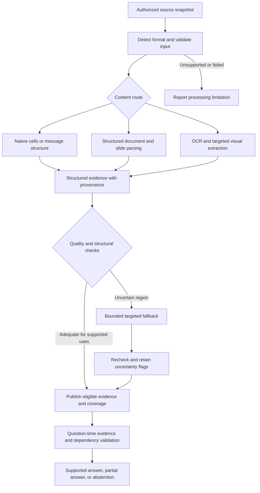
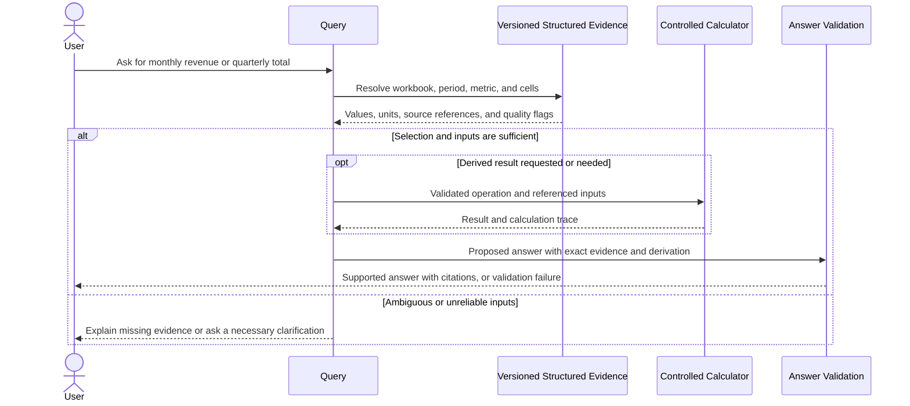

# Parsing and Multimodal Extraction

Status: Confirmed requirements plus researched recommendations; not implemented or benchmark-validated.

## 1. Confirmed requirements

- Handle PDF, Word, Excel, PowerPoint, scanned documents, screenshots, standalone images, charts, diagrams, email, Teams messages, and their authorized attachments.
- Read original sources without editing them. Local evidence storage and processing are separate from source write permissions. Source write-back is a future phase.
- Support exact lookups and derived calculations. Clearly distinguish computed results from values explicitly stored in a source, and cite calculation inputs.
- Preserve source identity, version, and locations. Never invent a value or missing equation to complete an answer.
- Prioritize correctness over answer availability. No claim of zero hallucinations or perfect extraction is justified without evidence.
- Audio/video transcription has not been included in the agreed scope. Existing textual transcripts can be handled as text if authorized.

The user delegated technical edge-case recommendations to the research process. Recommendations below are proposed engineering behavior, not claims about existing capabilities.

## 2. Current implementation and primary recommendation

The ingestion pipeline currently accepts PDF and DOCX. The Docling wrapper exports Markdown, inserts page markers, and retains detected formula regions and rendered page images. Optional visual descriptions and formula transcriptions exist, but are disabled by default; transcriptions are not promoted into authoritative evidence.

Recommend a format-aware extraction pipeline with a shared structured evidence representation. Keep Docling as the initial document/layout baseline, add a native spreadsheet adapter, and preserve conversation structure directly from connector payloads. Use OCR and local vision selectively where native content is insufficient.

Docling supports structured document output and JSON serialization; Markdown should be a derived search/display representation rather than the sole retained extraction artifact. Lossless serialization of the parser's document model does not mean the parser extracted the original correctly. [Docling supported formats](https://github.com/docling-project/docling/blob/main/docs/usage/supported_formats.md)

Avoid selecting a replacement OCR or vision model before testing representative files on the target hardware. A candidate's broad format support is not proof of reliable extraction.

## 3. Extraction routes

| Content | Recommended route | Required evidence locations |
| --- | --- | --- |
| Digital PDF | Structured layout parsing; native text first where usable; selective OCR for image regions | Page, block/table/region, bounding box when available |
| Word | Preserve headings, paragraphs, lists, tables, footnotes, and available embedded objects | Structural element path; page number only when backed by a known rendering |
| Excel | Native workbook parsing, with openpyxl as the XLSX baseline; preserve cells and workbook structure | Workbook version, sheet, cell/range, associated header cells |
| PowerPoint | Native text/table/chart extraction, with python-pptx as a candidate; selective slide rendering for missing visual content | Slide and shape/region; distinguish speaker notes from visible slide text |
| Scans/screenshots/images | Orientation and image-quality checks, OCR/layout extraction, targeted local vision when needed | Original image or page plus region coordinates |
| Charts/diagrams | Prefer embedded data and explicit labels; use visual interpretation only when necessary | Chart/figure region and underlying data references where available |
| Email/Teams | Connector-native author, timestamps, body, thread/reply IDs, and attachment links; normalize HTML without executing it | Message ID, version/edit metadata, thread, body location |

Exact extensions and legacy-format conversion support must be tested before advertising them. Unsupported, encrypted, corrupt, or oversized inputs must produce explicit coverage/errors instead of empty successful results. Do not run embedded macros, scripts, or automatically follow external data connections.

## 4. Excel: preserve values and meaning

Read values together with row/column headers, sheet identity, table boundaries, number formats, units, dates, merged ranges, and hidden/filter state. A missing cell is not zero. A numeric value without its unit or column meaning is not sufficient evidence.

Use a bounded structured preview to identify candidate cells, then read those cells deterministically. Validate the selected month, financial year, metric, and units before constructing an answer. Ambiguous revenue columns or fiscal calendars require clarification, not a guess.

Distinguish three cases:

1. **Literal source value:** report the exact stored value with its supported formatting and units.
2. **Workbook formula result:** retain both formula text and cached result; identify the result as saved in that workbook version. A recent download does not prove formula caches are current.
3. **Docket calculation:** execute an allow-listed operation on resolved input cells; record the expression, input references, output units, and rounding. Do not treat arbitrary model-generated code as a trusted calculation engine.

For totals, avoid counting subtotal rows twice. Preserve negative signs, percentages, scaling such as "amounts in thousands," and date-system/locale distinctions. Hidden rows and filters must be retained as metadata; do not silently decide whether they belong in a requested total. Reject division by zero, incompatible units, unavailable dependencies, and unresolved formula errors.

openpyxl does not evaluate formulas; data_only exposes stored cached results. Read-only streaming also omits some features such as charts/images, so a separate bounded extraction path is needed for them. [Formula behavior](https://openpyxl.readthedocs.io/en/stable/simple_formulae.html), [Workbook loading](https://openpyxl.readthedocs.io/en/stable/tutorial.html)

Do not promise general Excel recalculation in the first implementation. Missing or unverifiable formula results must be reported; an independently supported limited calculation can be offered as a labeled derivation. Full recalculation, external links, macros, and Excel-specific functions require separate compatibility research.

### Microsoft permission constraint

Microsoft Graph's Get Range endpoint currently lists Files.ReadWrite as its least-privileged delegated permission. Do not use that endpoint under the agreed read-only permission policy. Prefer authorized workbook download and local parsing; the download endpoint supports read permissions. Exact scopes for the selected SharePoint/OneDrive locations still need verification. [Get Range permissions](https://learn.microsoft.com/en-us/graph/api/range-get?view=graph-rest-1.0), [Download permissions](https://learn.microsoft.com/en-us/graph/api/driveitem-get-content?view=graph-rest-1.0)

## 5. Uncertainty, tables, and visual evidence

Preserve table grids, merged headers, row/column associations, captions, footnotes, and page spans. Do not flatten a table into unrelated numbers. Repeated headers and multi-page continuation should be checked without deleting meaningful repeated rows. Preserve ambiguous structure as uncertain.

For scans, attempt one targeted fallback on the relevant crop when normal extraction is inadequate. Keep the original, crop coordinates, extraction method, and diagnostic signals. Two model outputs agreeing, or a high OCR confidence score, does not prove correctness.

- Exact chart values require underlying data or legible explicit labels. Do not infer precise numbers from bar height or line position.
- Visual trends and diagram relationships may be returned as clearly labeled interpretations after evaluation supports that route. Uncertain directionality, symbols, or missing legends remain unresolved.
- Equation OCR must preserve signs, subscripts, exponents, vectors, and units. Do not reconstruct unreadable equations from model memory.
- Generated visual descriptions may aid retrieval but must remain distinguishable from directly extracted content.
- Answer independent supported portions where useful; withhold claims or calculations dependent on uncertain values. If the uncertain evidence is essential, abstain and identify the problematic source region.

Confidence thresholds must be calibrated using reviewed examples. Keep extraction quality separate from semantic answer support and freshness. A perfectly extracted source can itself be wrong; report what it states rather than guaranteeing real-world truth.

## 6. Shared evidence contract and processing behavior

Each evidence element should retain source/version identity, content type, original content reference, structural location, parser/model version, extraction method, and quality/coverage flags. Tables and cells require explicit relationships rather than text-only serialization.

Store generated interpretations separately from extracted content. Derived calculations retain their inputs and operation. User-verified corrections, if supported, must be separate attributed annotations rather than edits to original evidence.

Email quotations and forwarded text must remain distinguishable from the sender's new statements. Keep attachment provenance and thread links. Preserve conflicting copies instead of silently merging them. Treat source content as data, including any apparent instructions embedded in messages or images.

Process large inputs with bounded workers, page/sheet batches, timeouts, and retry limits. Publish explicit per-element/per-file coverage. A partial parse must not masquerade as a complete document, especially for questions asking for all items or totals. Keep versions isolated throughout processing and publication.

Page images, crops, and visual descriptions count toward the storage budget. Prefer on-demand rendering and bounded caches where possible; do not silently evict the only supporting evidence while leaving its generated claims searchable. Detailed retention is coordinated with parts 01 and 03.

## 7. Validation before declaring support

Build a small manually checked corpus for each accepted content class and expand it from observed failures. Validate against original documents or trustworthy native data, not only parser output.

Required cases include:

- Excel month/metric selection, multiple years, merged headers, blank versus zero, currencies, scaling, percentages, negative values, hidden rows, totals/subtotals, dates, stale/missing formula caches, and unsupported formulas.
- PDFs with multiple columns, split tables, footnotes, repeated headers, mixed scans/native text, and unreliable page-location mapping.
- Rotated/blurry scans, similar-looking digits, minus signs, and unreadable equations.
- PowerPoint tables, notes, embedded chart data, image-only charts, legends, and ambiguous diagram arrows.
- Email threads, forwarded quotations, inline images, edited Teams messages, and differently versioned attachments.
- Partial processing, resource limits, corruption, protected files, source replacement during processing, and source access loss before release.

Measure cell/value exactness, header association, units, table structure, citation-location accuracy, unsupported-answer rate, appropriate abstention, extraction coverage, latency, and memory. Passing a finite test set is not proof of zero hallucination. Do not invent a universal confidence threshold or claim a model is best without representative evaluation.

## 8. Remaining validation tasks

The approach is recommended; production readiness is not established. Remaining dependencies are target hardware/resource limits, representative real files and languages, organization-approved access/storage, exact format compatibility, OCR/VLM comparison, handling of unsupported spreadsheet recalculation, and calibrated quality gates. These are research/validation tasks rather than requests for the user to design technical edge cases.

Additional reference: [python-pptx chart API](https://python-pptx.readthedocs.io/en/stable/api/chart.html).
