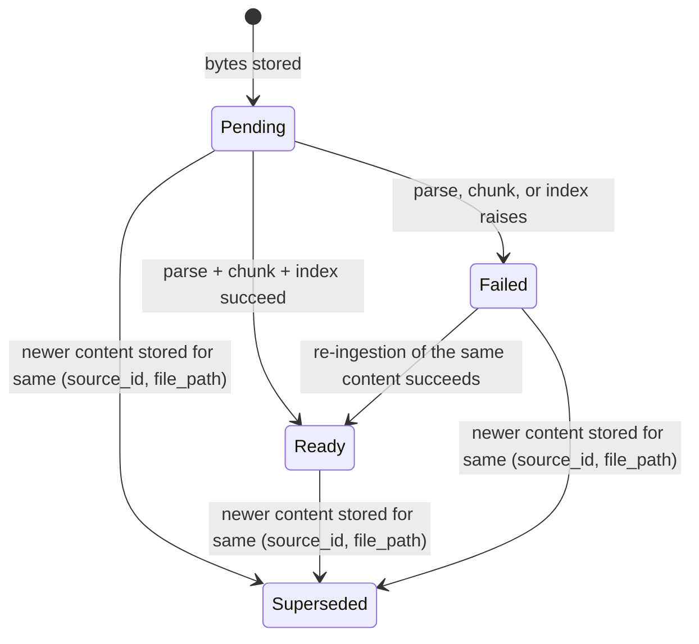
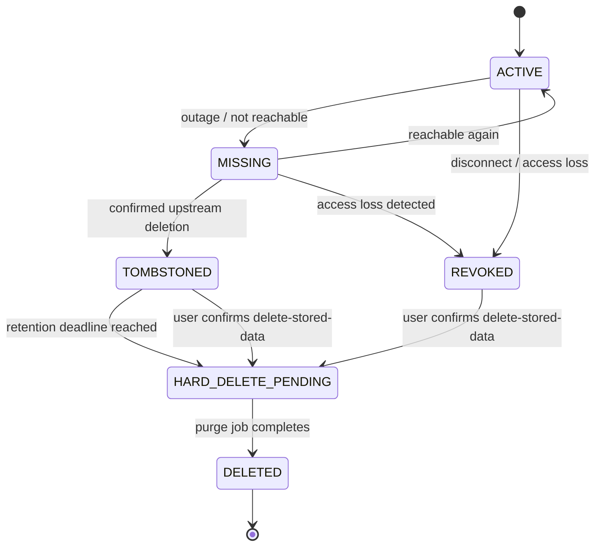
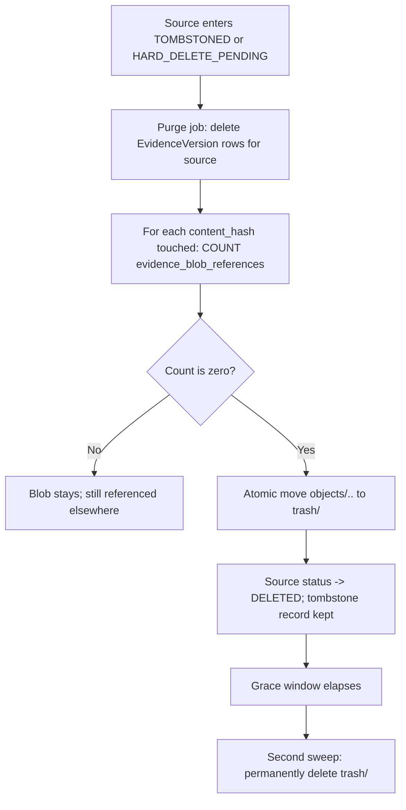

# Evidence Storage and Versioning

Status: Requirements agreed; implementation approach pending validation. This document was drafted bottom-up from a full audit of the current evidence-storage implementation, then its design choices were reviewed and decided with the user. Parts 01 and 02 each defer specific mechanics here ("the specific validation mechanisms will be designed in the parsing, retrieval, and trust documents," "detailed retention is coordinated with parts 01 and 03"); this document closes that gap.

## 1. Purpose and scope

Parts 01 and 02 describe source lifecycle and extraction behavior in product terms: keep the latest synchronized version, never mix content across versions, publish only after processing succeeds, preserve per-element provenance, bound storage, and support deletion without breaking previously issued citations. None of that is a new system — Docket already has a working evidence store and a version model. This document starts from what that implementation actually does today, identifies exactly where it stops short of what 01 and 02 assume, and proposes concrete mechanisms to close each gap: a richer version-readiness model, identity continuity across renames, a real deletion/retention state machine, sub-file evidence granularity, and safe blob garbage collection.

The scope is storage and versioning mechanics only. Connector-specific synchronization (part 01), extraction routes (part 02), chunking/indexing strategy (part 04), and retrieval/trust logic (parts 05/07) are referenced where they constrain this layer, not redesigned here.

## 2. Current implementation (verified against source)

| Component | Location | Behavior |
| --- | --- | --- |
| Blob store | `backend/src/docket/infra/evidence/store.py` (`ContentAddressedStore`) | SHA-256 of plaintext bytes; stored at `objects/<hash[:2]>/<hash>` under `settings.evidence_store_path`; JSON manifest (`byte_size`, `mime_type`, `original_filename`) at a parallel `manifests/` path; atomic temp-file + `fsync` + `os.replace` writes; `put()` is a no-op if the hash already exists (global, cross-source dedup of identical bytes). |
| Reserved directories | `store.py` docstring; created by `Settings.ensure_data_dirs()` (`backend/src/docket/core/config.py:85-89`) | `quarantine/` and `trash/` exist on disk but nothing ever writes to them. |
| Encryption | `store.py:35` (`ENCRYPTION_ENABLED = False`, module-level, not in `config.py`) | Bytes are stored unencrypted; explicitly deferred, not an oversight. |
| Version record | `EvidenceVersion` in `backend/src/docket/core/db/models.py` (~lines 137-176) | One row per stored version: `source_id`, nullable `file_path`, `content_hash`, `byte_size`, `mime_type`, `observed_at`, `parser_name`/`parser_version`, `is_current`. No version number, no predecessor link. |
| Current-version scoping | `EvidenceManager` in `backend/src/docket/infra/evidence/manager.py` | "Current" is scoped to `(source_id, file_path)`, fixed by migration `0002_evidence_version_file_path.py` after multi-file sources were found flipping the wrong file's row. `ingest_file()` is a no-op on unchanged bytes; on changed bytes, flips the old row to `is_current=False` and inserts the new row in one transaction. |
| Sub-file granularity | `EvidenceUnit`/`Chunk` in `models.py`; populated by `chunker.split_into_units` (`infra/parsing/chunker.py`) and `ChunkWriter` (`services/ingestion/chunk_writer.py`) | `EvidenceUnit` is a Docling markdown heading-delimited section (`unit_index`, free-text `heading`, `content_hash`). `Chunk` is a further text split of a unit. Both are text-only and format-agnostic — there is no structured cell/slide/message locator anywhere in this layer today. |
| Renames/moves | — (not handled) | `file_path` is the literal filesystem path string. A moved or renamed file is a brand-new, unrelated `(source_id, file_path)` lineage; the old path's history is abandoned with no link. |
| Mid-parse-failure behavior | `backend/src/docket/services/ingestion/pipeline.py` module docstring, point 2 | The new `EvidenceVersion` row is written and flipped `is_current=True` **before** parsing/chunking is attempted — intentional, so a demonstrably-changed file is never served under its stale content. If parsing then fails, the current version has zero chunks. Retrieval filters to `is_current=True` chunks, so this surfaces as "no evidence" rather than stale evidence — there is no distinct "ready"/"published" flag. |
| Reconciliation | `IngestionPipeline.run_ingestion_for_source`, end-of-run `reconcile_source` | Runs once per batch, not per file. An interrupted batch can leave stale chunks served until the next successful full run (a documented, deliberate tradeoff). |
| Revocation | `SourceManager.deactivate_source` (`backend/src/docket/services/sources/manager.py`) | Sets `Source.status = REVOKED`. Only affects retrieval filtering (`hybrid.py` filters to `ACTIVE`); no bytes, manifests, or version rows are ever deleted. |
| Unused lifecycle states | `SourceStatus` enum, `models.py` | `TOMBSTONED`, `HARD_DELETE_PENDING`, `DELETED` are defined but nothing in the codebase ever transitions into them. |
| Dedup scope | confirmed by `test_identical_content_across_sources_dedupes_in_store_not_in_db` | Dedup is store-level only; each source still gets its own `EvidenceVersion` row for identical bytes. |

## 3. What parts 01 and 02 already assume of this layer

| Requirement (source) | What it assumes | Current support |
| --- | --- | --- |
| "Publish it only after required processing and indexing succeed" (01 §5) | A version can be stored but not yet servable, and becomes servable only on an explicit, later signal | Not modeled — `is_current=True` is set at store time, before processing |
| "Never mix content or indexes from different versions" (01 §5) | Processing of version N+1 cannot contaminate version N's served chunks | Implicitly true today (old row flips `is_current=False` atomically with the new insert), but not provable from the schema alone once a readiness gate is added |
| "Provider item IDs should be retained so path changes are not automatically treated as new documents" (01 §5) | Version identity survives a rename/move | Not implemented for local files; `file_path` is the only key |
| Deletion/outage/revocation table (01 §6) | A multi-state lifecycle: outage vs. confirmed deletion vs. access loss vs. disconnect vs. delete-stored-data, each with different data effects | Only two states are reachable in practice (`ACTIVE`, `REVOKED`); the rest of the table has no corresponding mechanism |
| "Remove shared blobs only when no retained authorized references require them" (01 §6) | A computable notion of "is this blob still referenced" | No reference count exists in any form; nothing has ever needed to delete a blob |
| "A configurable total storage budget... pause new ingestion... offer cleanup" (01 §7) | Storage accounting and reclaimable space are both knowable | Byte sizes are recorded per version, but there is no safe-deletion path to reclaim anything |
| Per-element evidence contract: structural location, extracted-vs-generated separation (02 §6) | Evidence granularity below the file level, with a typed location (cell, slide, message) and a provenance label | `EvidenceUnit`/`Chunk` exist but are file-format-agnostic markdown sections; there is no cell/slide/message locator and no provenance field |

The common thread: the current schema has exactly one bit of state (`is_current`) doing the work of several things parts 01 and 02 need kept separate — "newest known content," "safe to serve," "still referenced," and "still authorized." The rest of this document splits those apart.

## 4. Version status: a single lifecycle enum replaces `is_current`

**Decision: replace the `is_current` boolean with one `status` enum column on `EvidenceVersion`: `PENDING → READY | FAILED`, with `SUPERSEDED` reachable from any of the three.** This was chosen over an additive second column (keeping `is_current` and adding a separate `publication_state`) because a single source of truth for a version's lifecycle was preferred over two columns that could, in principle, disagree.

- **`PENDING`** — bytes stored, not yet processed. Set at insert, in the same transaction as the blob write.
- **`READY`** — parsing, chunking, and indexing all succeeded; this version's chunks are servable.
- **`FAILED`** — processing raised; no chunks are servable. Distinct from a document that legitimately parses to zero chunks (e.g. a blank page), which is `READY` with no chunks rather than `FAILED`.
- **`SUPERSEDED`** — newer content has been stored for the same `(source_id, file_path)`. Reachable directly from `PENDING`, `READY`, or `FAILED` — this is what resolves the "superseded while still mid-processing" ambiguity the two-column design raised: supersession always wins immediately, regardless of where the old row was in its own lifecycle. If a processing job is still running against a row that gets superseded mid-flight, it checks the row's status before writing `READY`/`FAILED` and no-ops if it finds `SUPERSEDED` already set.

This replaces two queries that currently filter on `is_current`:

- **"Latest lineage slot" for a file** (today: `is_current = True`, in `EvidenceManager`'s current-version lookup) becomes `status != 'SUPERSEDED'`, scoped to `(source_id, file_path)` — should resolve to exactly one row, per migration 0002's existing scoping.
- **"Servable at query time"** (today: `is_current = True`, in the three retrieval queries in `backend/src/docket/infra/retrieval/hybrid.py`) becomes `status = 'READY'`.

Existing rows backfill deterministically: `is_current = True` → `READY` (already being served today), `is_current = False` → `SUPERSEDED` (the old model never distinguished a superseded-but-failed row from a cleanly superseded one, so there's no information loss in collapsing both to `SUPERSEDED`).

The one case worth naming explicitly: a version can sit at `status = FAILED` as the *latest* lineage slot (i.e., not yet superseded) — the newest known content, known to be unusable. Retrieval still serves nothing for it (only `READY` is servable), satisfying doc 01 §5's "do not silently present the previous value as current," but nothing today surfaces *why* — the existing `IngestionJob` table (`PENDING/RUNNING/SUCCEEDED/FAILED/PARTIAL`) tracks whole-batch status with no per-version link. Closing that reporting gap is a separate, smaller piece of follow-up work, not part of this schema change.

## 5. Version identity across renames and moves

Microsoft Graph gives every `driveItem` and message a stable identifier independent of path or filename; part 01 explicitly relies on this ("provider item IDs should be retained so path changes are not automatically treated as new documents"). Local files have no equivalent — the filesystem gives Docket a path and bytes, nothing else, and today `file_path` is used as if it were a stable identifier. A rename silently starts a new, disconnected lineage; the old path's version history is simply orphaned.

**Decision: deprioritize local-file rename tracking for this phase.** Most content will eventually arrive through M365 connectors with real stable IDs; building a best-effort, inherently-unreliable local heuristic now is speculative work against a gap connectors will largely make moot. No schema or code change is planned here for local-folder sources in this phase.

If this is revisited later, the mechanisms considered (neither a full substitute for a provider-issued ID) were:

1. **OS file identity as a hint.** Capture `st_dev`/`st_ino` (POSIX) or the NTFS file reference number (Windows) via `os.stat()` at ingest time, store it alongside `file_path` as a nullable `stable_item_id`. At scan time, a previously-seen inode reappearing under a new path within the same source root would be treated as a rename, carrying the lineage forward. Limitation: inode numbers aren't guaranteed stable across remounts of network filesystems or cloud-sync-client-managed folders — exactly the kind of folder a user might point Docket at for a OneDrive-synced local copy — and are reused after deletion.
2. **Content-hash correlation within a batch, as a fallback.** A path disappearing and a new path appearing in the same run with an identical content hash would surface as a probable rename. Strictly a heuristic: two unrelated files can share content, and a simultaneous rename-and-edit defeats it (the new path's hash won't match).

**Merge policy, decided for whenever this is built:** auto-merge lineage when both signals agree (OS identity and content hash both point to the same rename), and only fall back to asking the user when the signals conflict or only one is available. This is a deliberate exception to doc 01 §9's general correctness-first posture — justified here because requiring the two independent, differently-failing signals to agree makes a false positive materially less likely than relying on either alone, and a merge is reversible (it only links lineage; it does not delete or alter evidence).

## 6. Deletion, access loss, and retention as an explicit state machine

`SourceStatus` already defines `ACTIVE`, `MISSING`, `REVOKED`, `TOMBSTONED`, `HARD_DELETE_PENDING`, `DELETED`, but only `ACTIVE` and `REVOKED` are ever reached. Part 01 §6's table describes six distinct situations; this proposes mapping each onto a transition in the existing enum, rather than adding new states.

| Transition | Trigger | Data effect |
| --- | --- | --- |
| `ACTIVE → MISSING` | Connector/sync reports the item temporarily unreachable (network error, timeout, transient API failure) | Retain all content; keep serving the last known current version; surface a degraded-freshness indicator |
| `MISSING → ACTIVE` | Next successful sync confirms reachability | Clear the indicator; no data change |
| `MISSING → TOMBSTONED` | Connector *confirms* the upstream item no longer exists (e.g. a Graph delta deletion marker, or an explicit local-deletion signal). **Decided: no automatic escalation from repeated `MISSING` failures alone** — no local-folder signal today distinguishes "still trying" from "confirmed gone," and no connector exists yet to produce one; revisit once a connector can supply a real confirmed-deletion signal. | Exclude from the `ACTIVE`-only retrieval filter immediately (same enforcement point `hybrid.py` already uses); start the retention countdown (30 days by default, globally configurable — decided below) |
| `ACTIVE/MISSING → REVOKED` | (a) explicit user "disconnect" action (already implemented via `deactivate_source`), or (b) **decided:** a connector-detected access-loss signal (e.g. a 403-class response) reuses this same `REVOKED` transition rather than introducing a separate state — the practical effect (excluded from retrieval, no auto-cleanup) is identical either way, and the UI can distinguish "you disconnected it" from "access was revoked" with a separate reason field on the existing transition rather than a new enum value | Exclude from retrieval immediately; no cleanup triggered — `REVOKED` can persist indefinitely, since "disconnect" and "delete stored data" are deliberately separate actions in part 01 §6 |
| `REVOKED/TOMBSTONED → HARD_DELETE_PENDING` | Explicit user confirmation of "delete stored data," or a `TOMBSTONED` source's retention countdown reaching zero unattended | Queue the async purge job (§8); no visible behavior change yet — this is a scheduling state |
| `HARD_DELETE_PENDING → DELETED` | Purge job completes: `EvidenceVersion` rows removed, blobs released per the refcount check in §8, chunks/vector rows removed | Terminal. A minimal tombstone record (source id, deletion timestamp, reason) is kept indefinitely so a previously issued citation resolves to an explicit "this evidence was deleted on `<date>`" message rather than a broken or silently reassigned reference. **Decided: this tombstone message is sufficient** — doc 01 §6 itself expects that "historical questions may become unanswerable after cleanup," so deletion making some past citations unresolvable is accepted behavior, not a gap; persisting independent citation-time snapshots (a much larger feature, with its own retention policy and privacy implications of keeping deleted-source content around) is not planned. |

"Pause synchronization" from part 01's table deliberately does not map onto `SourceStatus` at all: a paused source is still `ACTIVE` and searchable on its last-synced content, only background refresh is suspended. Recommend a separate, orthogonal field (`sync_paused_at: datetime | None` on `Source`) rather than forcing it into the lifecycle enum, which would otherwise need an awkward "paused-but-still-active" state.

A `TOMBSTONED` source needs a concrete retention field to make the countdown real: `retention_deadline: datetime | None`, set on entry to `TOMBSTONED` as `now + <configured retention window>` (the bounded-history knob part 01 §7 already calls for). **Decided: the default retention window is 30 days, as a single global setting** (not per-source or per-connector-type) — simple to start with, and can be split later once a real connector exists to justify the extra config surface. A scheduled job advances expired sources to `HARD_DELETE_PENDING`.

## 7. Evidence granularity: toward a citable element, not just a file

Part 02's evidence contract needs a citation to resolve to a specific cell, slide shape, or message — not a file. The schema already has a sub-file layer (`EvidenceUnit`/`Chunk`), but it currently only represents a Docling markdown heading section: `unit_index` (position), a free-text `heading`, and a `content_hash` used purely as a DB dedup guard (it does not reference the blob store — only `EvidenceVersion.content_hash` and the hashes embedded in `page_images_json` do that). That shape has no way to say "sheet Revenue, cell B14" or "slide 3, shape 7" or "message `<id>`, body" as a structured location.

The minimal, additive change — in line with the project's existing pattern for optional structure (`page_images_json`, `formula_transcriptions_json` are both nullable columns added without backfill) — is two new nullable columns on `EvidenceUnit`:

- `unit_kind`: a short string (`'section'` by default for the existing Docling path; future values `'cell'`, `'range'`, `'slide'`, `'message'`, etc.), and
- `locator_json`: a kind-specific structured location (`{"sheet": "Revenue", "cell": "B14"}`, `{"slide": 3, "shape_id": 7}`, `{"message_id": "...", "part": "body"}`), leaving the existing `heading` field as a human-readable label rather than replacing it.

Separately, doc 02 §4 and §6 need retrieval to distinguish a literal stored value, a Docket-computed derivation (with its inputs and operation kept alongside the result), and a generated interpretation (visual description, formula transcription) that must never be mistaken for extracted fact. **Decided: add a `provenance` field (`extracted` / `derived` / `generated`) on `Chunk` only**, not `EvidenceUnit` — `Chunk` is what retrieval actually filters and serves, which is where this distinction needs to be enforced at query time; keeping it to one table avoids a second copy to keep in sync. Today this separation exists only by convention and omission — `formula_transcriptions_json` is simply never read by the citable retrieval path — which is a weaker guarantee than an explicit, queryable label, and doc 02's "labeled interpretation of a chart" use case needs the content to be retrievable-but-labeled, not merely absent.

**Decided: design the per-kind `locator_json` shape only when each adapter is actually built**, not as one unified schema up front. Define only the two generic columns (`unit_kind`, `locator_json`) now, let the first real adapter (spreadsheets, per part 02's stated priority) validate the `cell`/`range` shape in practice, and generalize once a second kind exists to compare against — avoids speculatively fixing three untested schemas at once.

## 8. Blob lifecycle: reference counting and safe garbage collection

`ContentAddressedStore.put()` is dedup-on-write only; nothing on the delete side has ever needed to ask "how many live references point at this hash," because nothing has ever deleted a blob. Part 01 §6 requires exactly that answer before a shared blob can be removed.

Two kinds of reference into the store exist today, with very different visibility:

1. `EvidenceVersion.content_hash` — an indexed DB column, trivially countable.
2. Entries inside `EvidenceVersion.page_images_json` (a JSON map of `{page_no: content_hash}` pointing at page-image objects in the *same* store) — not a column, not indexed, not queryable without scanning and parsing JSON on every row. `formula_regions_json`/`formula_transcriptions_json` should be audited the same way before assuming they hold no further hash references.

Recommend an explicit `evidence_blob_references` table (`content_hash`, `referencing_table`, `referencing_id`, `role`), written in the same transaction as any code path that writes a hash into the store — `EvidenceManager.ingest_file` for primary bytes, the page-image capture path for page images, and so on. This leaves hashing and `put()` untouched, adds one small write per reference, and turns "is this blob safe to delete" into a single indexed `COUNT` query instead of a full-table JSON scan at purge time (acceptable, since purge is a rare async batch job, not a hot path).

Safe-delete rule: a blob is eligible for removal only when it has zero rows in `evidence_blob_references`, and the removal that brought it to zero was itself driven by the same purge job that enforces the `TOMBSTONED` retention window from §6 — refcounting and retention must share one trigger, not race as two independent ones.

Recommend a two-phase delete that finally gives the already-reserved `trash/` directory (named for exactly this in `store.py`'s own docstring) a job: move a zero-referenced object from `objects/<hash[:2]>/<hash>` to `trash/<hash>` with an atomic rename (the same `os.replace` pattern `_atomic_write` already uses), rather than unlinking immediately; a second, independent sweep permanently deletes from `trash/` only after its own grace window. **Decided: the trash grace window is independent of the `TOMBSTONED` retention deadline, and shorter — 7 days by default.** The `TOMBSTONED` window exists to give a deleted source a chance to reappear; the trash window is just a last-resort safety margin against a buggy purge job, and tying the two together would leave a blob double-counted against the storage budget (part 01 §7) for up to 30 days for no real benefit.

`quarantine/` (also reserved, also unused) is a different concern from deletion, and from the `FAILED` status in §4: it holds bytes that fail *before* ever becoming an `EvidenceVersion` row at all — a wholly unsupported, corrupt, or encrypted input (part 02 §3's "must produce explicit coverage/errors instead of empty successful results"). `FAILED` (§4), by contrast, is a status on a row that *was* created — a recognized file whose bytes were stored but whose parsing/chunking/indexing then failed. These stay structurally distinct because they occur at different points: quarantine is pre-row, `FAILED` is post-row; there's no natural way to collapse them into one mechanism.

## 9. A note on encryption at rest

Section 2's scope cut (`ENCRYPTION_ENABLED = False` in `store.py`) is not revisited here, but the design above constrains how it should eventually be done: content-addressing must stay keyed on the **plaintext** hash. If encryption were added by hashing ciphertext instead, identical plaintext encrypted with different keys or nonces would hash differently, silently breaking the cross-source dedup this store exists to provide. The expected shape, when this is picked up, is: hash plaintext for identity and `evidence_blob_references`/`EvidenceVersion.content_hash` as today, then encrypt the bytes under that identity before the atomic write — the hash stays a content identifier, not a ciphertext identifier.

## 10. Remaining implementation-time validation

All product/design decisions this document raised have been resolved (§4 version-status model, §5 rename-tracking scope, §6 retention/access-loss/escalation defaults, §7 locator and provenance placement, §8 trash grace window). `formula_regions_json` and `formula_transcriptions_json` were checked directly against `backend/src/docket/services/ingestion/formula_transcriber.py`, `visual_indexer.py`, and `eval/formula_review.py`: they hold region metadata (bounding boxes, `item_ref`/`page_no`) and transcription text respectively, not content-store hashes — only `page_images_json` does — so the `evidence_blob_references` table in §8 only needs to account for `EvidenceVersion.content_hash` and `page_images_json`'s entries.

What's left is purely mechanical, to verify during implementation rather than decide now:

- The `is_current` → `status` enum migration must backfill existing rows (`True` → `READY`, `False` → `SUPERSEDED`) and pass the full existing test suite (`test_evidence_manager.py`, `ingestion/test_pipeline.py`, and anything in `hybrid.py`'s test coverage) with the query changes described in §4 applied.
- Confirm the SQLAlchemy/Alembic enum-column migration pattern already used elsewhere in `core/db/migrations/versions/` (e.g. how `SourceStatus` itself was added) is reused for the new `status` column, rather than introducing a second convention.
- Confirm no other code path beyond the three queries named in §4 and the `EvidenceManager` lookup reads `is_current` directly before it's removed.

## References

Internal:

- `backend/src/docket/infra/evidence/store.py` — `ContentAddressedStore`, atomic writes, reserved `quarantine/`/`trash/`, `ENCRYPTION_ENABLED`
- `backend/src/docket/infra/evidence/manager.py` — `EvidenceManager`, current-version scoping, `ingest_file`
- `backend/src/docket/core/db/models.py` — `EvidenceVersion`, `EvidenceUnit`, `Chunk`, `Source`, `SourceStatus`
- `backend/src/docket/core/db/migrations/versions/0002_evidence_version_file_path.py` — why "current" is scoped by `(source_id, file_path)`
- `backend/src/docket/services/ingestion/pipeline.py` — store-before-process rationale, batch-level reconciliation tradeoff
- `backend/src/docket/infra/parsing/chunker.py`, `backend/src/docket/services/ingestion/chunk_writer.py` — current `EvidenceUnit`/`Chunk` granularity (markdown sections)
- `backend/src/docket/infra/retrieval/hybrid.py` — the `is_current`/`ACTIVE` retrieval filter this document replaces with `status = 'READY'`/`ACTIVE`
- `backend/src/docket/services/sources/manager.py` — `deactivate_source` / `REVOKED`
- `backend/src/docket/core/config.py` — `Settings.ensure_data_dirs`, `evidence_store_path`
- `Upgrade/01-sources-and-lifecycle.md` — version policy, deletion/outage table, storage budget requirements this document implements
- `Upgrade/02-parsing-and-multimodal-extraction.md` — per-element evidence contract, extracted-vs-generated separation

External:

- [Git internals: Git objects](https://git-scm.com/book/en/v2/Git-Internals-Git-Objects) — content-addressable storage model this store already follows
- [restic design documentation](https://restic.readthedocs.io/en/stable/100_references.html) — reference counting, prune/GC patterns for a content-addressed repository, directly relevant to §8
- [inotify(7) — IN_MOVED_FROM / IN_MOVED_TO](https://man7.org/linux/man-pages/man7/inotify.7.html) — atomic rename detection on Linux, relevant to §5 mechanism 1
- [Python watchdog: FileSystemMovedEvent](https://python-watchdog.readthedocs.io/en/stable/api.html#watchdog.events.FileSystemMovedEvent) — cross-platform rename event abstraction, relevant to §5
- [Microsoft Graph driveItem resource](https://learn.microsoft.com/en-us/graph/api/resources/driveitem) — stable item IDs that local files lack, motivating §5
