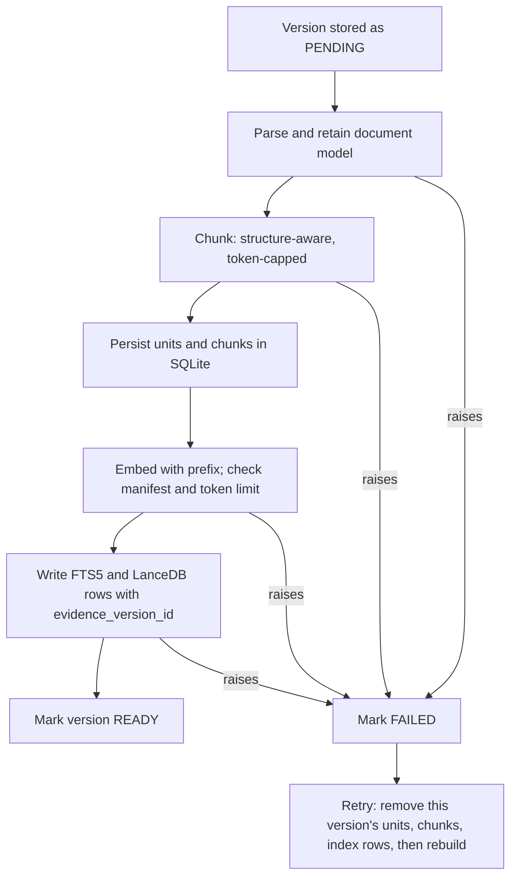
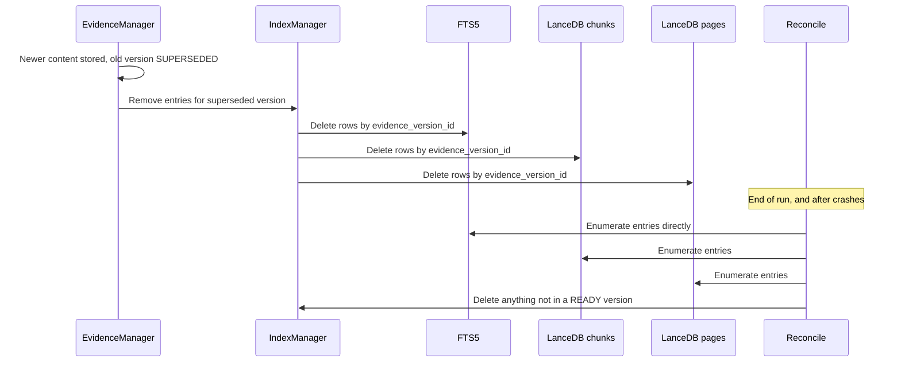
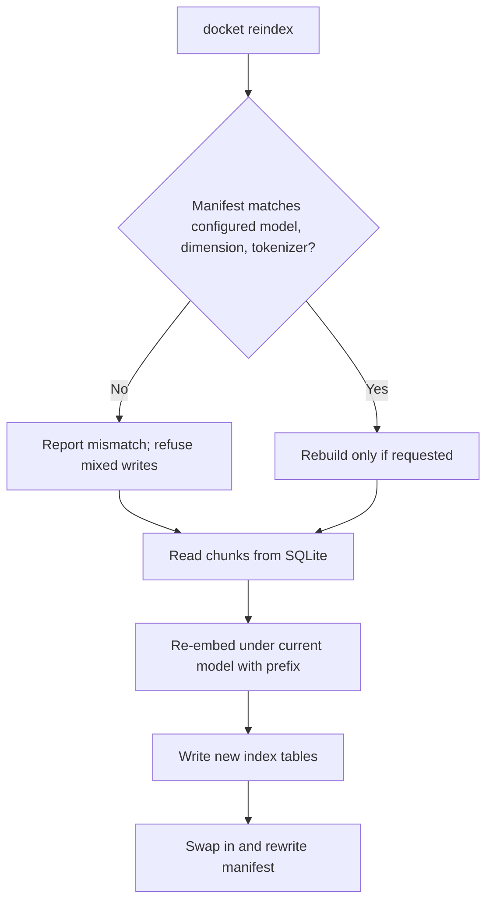

# Chunking and Indexing

Status: Requirements agreed; implementation approach pending validation. This document was drafted bottom-up from an audit of the current chunking and indexing code and a scan of current retrieval practice. Four design choices were reviewed and decided with the user and are marked **Decided**. Everything derived from the scan alone is marked **Recommended (pending validation)**: none of it has been benchmarked on Docket's target hardware or corpus, and parts 02 and 08 require that before any claim of improvement. Parts 01–03 defer the mechanics of derived indexes here ("never mix content or indexes from different versions," "remove … derived indexes," "the storage budget covers embeddings and indexes"); this document closes that gap.

## 1. Purpose and scope

Part 03 settles what is stored and when a version becomes servable. This document covers the next step: how a `READY`-bound version's evidence is split into chunks, how those chunks are embedded and written to the search indexes, and how the indexes stay consistent with the evidence store across supersession, failure, deletion, and model change.

In scope: splitting, chunk identity and recipes, the FTS5 and LanceDB write/delete/consistency paths, embeddings, index rebuild, index-time context, storage accounting, and the shape of message units. Out of scope, referenced where they constrain this layer: ranking, fusion, and query rewriting (part 05), claim validation and abstention (part 07), connector synchronization (part 01), and the evaluation harness (part 08).

## 2. Current implementation (verified against source)

| Component | Location | Behavior |
| --- | --- | --- |
| PDF/DOCX splitting | `backend/src/docket/infra/parsing/chunker.py` (`_HEADING_RE`, line 27) | Docling Markdown is split into units at ATX headings levels 1–3, then each unit into word windows. Level 4+ headings do not split. Chunks never cross a unit boundary. |
| Window size | `backend/src/docket/core/config.py:47-48` | `chunk_size_words = 200`, `chunk_overlap_words = 40`. Words are `str.split()` tokens rejoined with a single space, so newlines, Markdown table structure, and list structure are flattened inside chunks. There is no token count, no character cap, and no check against the embedding model's context. |
| Heading context | `chunker.py` (`ChunkDraft.heading`) | Only the leaf heading is kept, and only as the `chunks.heading` column. The heading line is part of the unit text, so only the first window of a section contains it. No heading path, document title, or filename is in any chunk's text. |
| Tables (Docling) | `chunker.py`, `infra/parsing/docling_wrapper.py` | No table-aware splitting. A table is ordinary words and can be cut mid-row; column headers are not repeated in later windows. |
| Page spans | `docling_wrapper.py` (`_insert_page_markers`), `chunker.py` | `<!--PAGE:N-->` markers are inserted by anchoring text, then stripped by the chunker to derive `page_start`/`page_end`. Anchors must be at least 32 characters, tables and formulas are generally not matched, so spans are approximate. |
| Retained parse artifact | `docling_wrapper.py:312` | Only `export_to_markdown()` is called. The Docling document (`result.document`) is discarded after Markdown, regions, and page images are extracted, contrary to part 02 §2's recommendation to retain the structured model. |
| XLSX / PPTX | `infra/parsing/xlsx_chunker.py`, `pptx_chunker.py` | XLSX: one unit and chunk per populated row (`unit_kind = range`), text is `Header: value` lines plus sheet/row, annotations for formulas, hidden rows, and unresolved errors. PPTX: one unit and chunk per text shape, table data row, chart, and notes block. Neither has a size cap, so a long text box or notes block is one unbounded chunk. |
| Recipe | `core/db/identity.py` (`compute_recipe_id`), `infra/parsing/recipes.py` (`DEFAULT_SPLITTER`) | One `rcp_` hash over `{chunk_size, overlap, splitter, parser_name, parser_version}`. The pipeline builds a single recipe from the Docling parser's identity and stamps the same ID on XLSX and PPTX chunks, for which `chunk_size`/`overlap` are meaningless and whose parser versions never enter the hash. |
| Chunk identity | `identity.py` (`compute_chunk_id`) | `chk_` + SHA-256 over `evidence_version_id`, recipe ID, ordinal, and content hash. Identical text in two versions gets different IDs: there is no cross-version chunk or embedding reuse. |
| Recipe change | `infra/evidence/manager.py`, `services/ingestion/pipeline.py` | "Unchanged" is decided by file `content_hash` and `READY` status alone. Changing chunk size, overlap, splitter, or parser version has no effect on already-`READY` files, and nothing detects or reports the mismatch. |
| Write order | `services/ingestion/pipeline.py`, `chunk_writer.py`, `infra/index/manager.py` | parse → regions/page images → (optional visual index) → chunk → `persist_units_and_chunks` (SQLite, committed) → `IndexManager.upsert_chunks` (FTS5, then LanceDB) → `mark_version_status(READY)`. SQLite rows are committed before the indexes are written, so a failed index write leaves a `FAILED` version with its chunk rows in place. |
| Retry of `FAILED` | `chunk_writer.py`, `test_pipeline.py` | Chunk IDs are deterministic, so a retry that reuses the version row re-inserts the same primary keys and new random-ID `EvidenceUnit` rows. No cleanup of prior units or chunks was found. The only retry test fails at `parse`, before anything is persisted, so this path is untested. |
| FTS5 | `core/db/migrations/versions/0003_fts_porter_stemming.py:59-63` | `fts_chunks(chunk_id UNINDEXED, text)` with `tokenize='porter unicode61 remove_diacritics 2'`. A standalone table: no heading, source, version, or provenance column, and no automatic sync with `chunks`. |
| Vector index | `infra/index/vector_index.py` | LanceDB `chunks` table, schema inferred from the first write: `chunk_id, source_id, text, vector`. Upsert via `merge_insert("chunk_id")`. No version, status, or provenance column. No ANN index (brute-force search) and no scalar index. |
| Embedding | `infra/inference/gateway.py:120` (`OllamaGateway.embed`), `infra/index/manager.py:50` | One Ollama call per chunk, sequential, no batching, retry, or truncation. Model is `qwen3-embedding:0.6b` (`config.py:12`). The model name and vector dimension are recorded nowhere: not on chunks, recipes, or the LanceDB table. |
| Visual index | `infra/index/visual_index.py`, `services/ingestion/visual_indexer.py` | LanceDB `pages` table keyed by `(evidence_version_id, page_no)`. VLM description, then one embedding per page. Off by default (`visual_index_enabled = False`). It runs before chunking, so a later failure leaves page rows for a `FAILED` version. |
| Reconciliation | `infra/index/manager.py` (`reconcile_source`, `delete_source`) | Runs once at the end of each source run. Stale chunk IDs are found via the **vector table only**, so an FTS-only orphan (crash between the two writes) is never found. `FtsIndexWriter.delete_by_source` deliberately raises `NotImplementedError`. Nothing calls any deletion method on the visual `pages` table: it is constructed (`interfaces/cli/context.py:201`) but never reconciled or purged. |
| Query-time isolation | `infra/retrieval/hybrid.py:233` (vector leg), `:329` (visual leg) | The vector leg runs `search(...).limit(top_k)` and only then post-filters through `_filter_active_and_current`, so stale or non-`READY` hits can occupy top-k slots and return fewer than `top_k` valid results. The FTS leg filters in SQL before `ORDER BY … LIMIT`. |
| Provenance | `core/db/models.py:391` | `Chunk.provenance` (default `extracted`) exists in SQLite only. It is not in FTS5 or LanceDB, no retrieval code filters on it, and nothing produces `derived` or `generated` chunks yet. Visual descriptions live only in `pages`; formula transcriptions only in `formula_transcriptions_json`. |

## 3. What parts 01–03 already assume of this layer

| Requirement (source) | What it assumes | Current support |
| --- | --- | --- |
| "Never mix content or indexes from different versions" (01 §5) | An index entry is attributable to exactly one version, and can be excluded or removed per version | Not modeled: entries carry `source_id` at most. Isolation is a query-time join plus end-of-run reconcile |
| Delete stored data removes "derived indexes" (01 §6) | Every derived structure is reachable from the source being purged | FTS and vector chunks are; the `pages` table and FTS-only orphans are not |
| Storage budget across "embeddings, and indexes" (01 §7) | Index size is measurable per source/version | Nothing measures LanceDB, FTS5, or page-image footprint |
| Extracted / derived / generated separation (02 §6, 03 §7) | The label reaches retrieval | Stored in SQLite only; the indexes cannot filter on it |
| Exact structured values with cell locators (01 §1, 02 §4) | The index finds the right sheet/row/range; values are read deterministically | Row chunks carry headers, but numbers, cell addresses, and display formats are not searchable (see §10) |
| Typed units for cells, slides, messages (03 §7) | A chunker per `unit_kind` | `section`, `range` (XLSX), and PPTX kinds exist; `message` does not |
| Partial parses must not masquerade as complete (02 §6) | Coverage is knowable per version | Chunk counts exist, but no per-unit coverage or truncation flag |

The common thread: derived indexes are treated as a global side store rather than as data owned by a version, so correctness today rests on filters and cleanup that must never be skipped.

## 4. What current practice implies

Findings from a scan of primary documentation and recent papers. These inform the recommendations below; they are evidence about other systems and datasets, not measurements of Docket.

- **Structure-aware chunking.** Docling's `HybridChunker` operates on the retained document model, is aligned to the embedding model's tokenizer through `max_tokens`, splits oversized items and merges undersized peers under the same headings, repeats table headers across chunks (`repeat_table_header`, `omit_header_on_overflow`), and exposes heading paths, page numbers, and bounding boxes per chunk. `contextualize()` returns an enriched serialization intended for the embedding model, separate from the raw chunk text. [Docling chunking](https://docling-project.github.io/docling/concepts/chunking/)
- **Chunk-side context.** Anthropic's Contextual Retrieval reports the top-20 retrieval failure rate falling from 5.7% to 3.7% with contextual embeddings, 2.9% with contextual BM25 added, and 1.9% with reranking added, at the cost of one LLM call per chunk. [Anthropic](https://www.anthropic.com/news/contextual-retrieval) A 2026 study of title-chain prefixes (document header hierarchy prepended to the chunk) reports MRR@5 rising from 0.374 to 0.463 with no extra LLM calls, and cautions that on/off ablations can mislead because stripping the prefix also removes the signal annotators use to judge relevance. [arXiv 2608.00824](https://arxiv.org/abs/2608.00824) Late chunking embeds the whole document through a long-context model before pooling per chunk; it needs an embedder that can take the whole document.
- **Tabular data.** A 2026 work-in-progress paper on structure-aware tabular chunking (row tree, token-constrained splits aligned to structure, overlap-free merging) reports MRR 0.3576 → 0.5945 and Recall@1 0.366 → 0.754 (BM25-only) on a single dataset. [arXiv 2605.00318](https://arxiv.org/abs/2605.00318) Spreadsheet RAG work generally uses multi-granular units (row, column, window) and iterative tool-calling retrieval, and reports that semantic cell-role annotation helps answer generation more than retrieval.
- **LanceDB.** Pre-filtering is the default; post-filtering "can return fewer than `limit` rows, or even zero." Scalar indexes on filter columns reduce latency, and IVF_PQ/IVF_RQ are preferred over HNSW variants for filtered workloads. Rows added after an FTS index is built are scanned flat until `optimize()` runs. LanceDB's FTS has no boolean operators, so it does not replace SQLite FTS5's query expressiveness. [Filtering](https://docs.lancedb.com/search/filtering), [Full-text search](https://docs.lancedb.com/search/full-text-search)
- **Embeddings.** Qwen3-Embedding is instruction-aware (a task instruction on the query side) and supports reduced Matryoshka dimensions. Published context-length and dimension figures differ between sources and between the Hugging Face and Ollama builds, so the exact limits must be read from the deployed model, not assumed.
- **Visual retrieval.** ColPali/ColQwen embed rendered pages as patch vectors with late-interaction scoring and avoid OCR, which helps charts and complex layouts. They are a candidate replacement for the description-based `pages` index, but fit on the target hardware is unmeasured.

## 5. Chunk identity, recipes, and retry

Three mismatches in §2 need to be closed regardless of any other choice here:

- **Per-parser recipes.** The recipe ID should hash only parameters that parser actually uses: window parameters for the text splitter, none for row/shape chunkers, and the parser's own name and version in every case. A change then invalidates exactly the files it affects.
- **Detectable recipe drift.** "Unchanged" currently means unchanged bytes. A version whose stored recipe differs from the current recipe for its parser must be reported, and re-chunked on request, rather than silently kept. Re-chunking creates a new chunk set for the same version under the new recipe and publishes it only after indexing succeeds, mirroring part 03 §4.
- **Defined retry rule.** Re-processing a `FAILED` version must first remove that version's prior units, chunks, and index entries inside one transaction scope, then rebuild. The failing-after-persist path needs a test before this is relied on.

## 6. Index isolation by version

**Decided: add `evidence_version_id` to index rows and apply the eligibility filter before top-k.** Each LanceDB `chunks` row and each FTS5 row carries `evidence_version_id`. The vector leg filters on `READY`/`ACTIVE` eligibility as a pre-filter (LanceDB's default) rather than post-filtering the top-k, so stale hits cannot displace valid ones or return fewer than `top_k`. When `ingest_file` supersedes a version (03 §4), that version's index entries are removed then, rather than waiting for the end-of-run reconcile; the reconcile remains as the repair path. Reconcile and purge enumerate FTS entries directly (by version/source), so an FTS-only orphan no longer depends on the vector table to be found, and the visual `pages` table is included in supersede, reconcile, and purge. This gives the "never mix content or indexes from different versions" rule (01 §5) a structural basis instead of a procedural one.

**Recommended (pending validation):**

- Create scalar indexes on `source_id` and `evidence_version_id` in LanceDB, and call `optimize()` after bulk writes so newly written rows are not left in flat-scan fragments.
- Add an ANN index (IVF_PQ or IVF_RQ, per LanceDB's filtered-workload guidance) only past a chunk count measured to need it; brute-force search is adequate for small collections and has no index to keep consistent.
- Keep SQLite FTS5 for keyword search: its query syntax and the existing porter tokenizer are relied on, and LanceDB's FTS lacks boolean operators.
- Carry `provenance` into both indexes so retrieval can filter or label by it (part 07).

## 7. Embeddings and rebuild

**Decided: record an index manifest and add `docket reindex`.** A small manifest, stored with the index, records the embedding model, its vector dimension, and the tokenizer used for token counting (§9). On startup and before any write, the configured model is compared to the manifest: a mismatch is reported as an error instead of writing vectors into a different space, which today would silently degrade semantic ranking. `docket reindex` rebuilds FTS5 and the vector table from the SQLite `chunks` (the source of truth, as migration 0003 already treated it), re-embedding under the current model and rewriting the manifest. The embedding model stays out of the chunk recipe: changing it re-embeds but does not re-chunk.

**Recommended (pending validation):**

- Batch embedding calls with a bounded retry and timeout; today each chunk is a sequential single call with no retry.
- Apply the query-side task instruction the model supports, and keep the instruction text in the manifest so queries and documents stay consistent.
- Evaluate Matryoshka truncation as a storage lever against the budget (§11), measured for recall loss before adoption.
- Reject or split any text over the embedder's context before the call, using the manifest's tokenizer.

## 8. Chunk context

**Decided: embed and keyword-index a context prefix, keep the stored text verbatim.** Each chunk's embedded text and FTS5 text is prefixed with its source file name and heading breadcrumb. `Chunk.text`, which citations and the resolver quote, is unchanged, so the evidence shown to the user is exactly what was extracted (02 §6: keep extracted and generated content distinguishable). The full heading path is stored as structure rather than only the leaf heading, so every window of a long section carries its context, not just the first.

**Recommended (pending validation):**

- Make the deterministic title-chain prefix the default: it needs no model call and the 2026 study above reports a gain from it.
- Treat LLM-generated contextual snippets (Anthropic's method) as optional and off by default: one local-model call per chunk is costly on the target hardware, and the gain over the deterministic prefix is unmeasured here. Any generated snippet is stored as `generated`, indexed for retrieval only, and never shown as citable text.
- Evaluate the prefix per candidate at retrieval time, not only by switching it on and off, given the cited warning about ablation artifacts (part 08).

## 9. Tables and size

**Decided: split tables on row boundaries with the header repeated, and bound every chunker by tokens.** A Docling table is never cut mid-row, and each window repeats the table's header row. Every chunker (text, XLSX, PPTX) enforces a token cap that is checked against the embedding model's context, splitting oversized XLSX/PPTX units on cell or paragraph boundaries while keeping the original locator, instead of emitting one unbounded chunk.

**Recommended implementation (pending validation):** move PDF/DOCX chunking onto Docling's `HybridChunker` over the retained document model, with its tokenizer taken from the embedding model. It provides row-aware table splitting with header repetition, heading paths, and page/bounding-box provenance natively, replacing both the word-window splitter and the marker-based page-span derivation. Three facts constrain this:

- **Prerequisite, verified.** The installed `docling-core` (2.97.2) exposes `HybridChunker` with `repeat_table_header`, `merge_peers`, `omit_header_on_overflow`, and `always_emit_headings`. But the parser keeps only Markdown (`docling_wrapper.py:312`). The Docling document must first be retained as a versioned artifact in the content-addressed store with a blob reference row (03 §8), as part 02 §2 already recommends.
- **Local-first constraint.** A tokenizer matching the embedding model is a download. The design must state how it is bundled or cached for offline installs, and a tokenizer mismatch is a manifest error (§7), not a silent miscount.
- **Compatibility.** Page spans and unit/chunk shape must stay stable for `EvidenceResolver` and existing citations during the switch, so it ships behind a recipe change (§5), not in place.

Because this replaces the core splitter, it is the highest-risk recommendation in this document, and it needs the comparison in part 08 before replacing the current splitter.

## 10. Spreadsheets: locating versus exact values

The index exists to find the right sheet, row, or range. The value itself is read deterministically from the workbook by locator, never from the chunk text (02 §4). Row chunks with header labels therefore stay. What the index must additionally support, because the FTS query path today splits on `\w+`, so `1,234.56` becomes `1`, `234`, `56`, and cell addresses appear only in `locator_json`:

**Recommended (pending validation):**

- **Normalized numeric tokens** in the indexed text, so formatted and raw forms of a number match.
- **Cell addresses** (e.g. `B14`) in the indexed text alongside the locator.
- **A schema card per sheet** as an extra unit: headers, detected table boundaries, units, and fiscal-year or period labels, so "August revenue FY 2025–26" can find the sheet before any row. Calendar and revenue-column ambiguity still requires clarification (02 §4).
- **Multi-granular units** (row, plus column or window summaries) are an evaluated option, not a default: the cited work reports more gain from structure-aware row units than from added granularity.

How these are queried, and how ambiguous matches are resolved, belongs to part 05. This document only fixes what is indexed.

## 11. Storage accounting

Part 01 §7's budget must include what this layer writes: vectors in LanceDB, FTS5 pages, the visual `pages` table, and any retained Docling document and page images (03 §8). Each is measured per source and per version, from the same references that drive blob garbage collection, so usage shown to the user and space reclaimable at purge agree. Index entries removed at supersession (§6) count as reclaimed. When the budget is reached, ingestion pauses before embedding, not after, so a half-indexed version is never left behind.

## 12. Message units (email and Teams)

No email or Teams parser exists (`SUPPORTED_EXTENSIONS` covers `.docx`, `.pdf`, `.xlsx`, `.pptx`). The design constraint is that a message is the citable unit (`unit_kind = message`, 03 §7): chunks never span messages, a long message splits on paragraph boundaries within the message, and every chunk carries thread, author, and timestamp in its context prefix (§8). Quoted and forwarded text is its own unit marked as quoted, so it is not attributed to the sender's new statement (02 §6). Attachments are separate sources with their own versions. Edited messages create a new version of the same item (01 §5), indexed under §6. This is design only: chunk sizes and thread-window rules need real mailbox samples first.

## 13. Diagrams

## 14. Remaining implementation-time validation

The product and design choices in §6–§9 are decided. Everything else here is to verify during implementation:

- **Untested paths to add before relying on them:** recipe change, embedding-model or dimension change, failure after chunk persistence followed by retry, visual-index cleanup, and oversized chunks.
- **LanceDB behavior to confirm on the installed version (0.39.0):** the default row limit on `search().to_list()` for per-source lookups (chunk-ID enumeration for reconcile may truncate silently if bounded), the length limits of `chunk_id IN (...)` delete predicates, and that adding the new columns is handled by schema evolution rather than a table rebuild.
- **Ollama embedding limits:** the context length and available dimensions of the deployed `qwen3-embedding` build, read from the model itself.
- **Migration:** existing indexes have no version column or manifest. Backfill from SQLite (`chunks`, `evidence_versions`) and write the manifest on first run; confirm the old and new index states cannot both serve.
- **Comparisons deferred to part 08:** current splitter versus `HybridChunker`, prefix on/off per candidate, deterministic prefix versus generated context, and any ANN-index or Matryoshka threshold. None of these is claimed beneficial until measured on representative files and target hardware.
- **Format coverage:** `.xls`, `.xlsm`, and `.ppt` remain unsupported (`UNSUPPORTED_EXTENSIONS`), unchanged by this document.

## References

Internal:

- `backend/src/docket/infra/parsing/chunker.py`: heading split, word windows, page-marker span derivation
- `backend/src/docket/infra/parsing/xlsx_chunker.py`, `pptx_chunker.py`: row and shape chunkers
- `backend/src/docket/infra/parsing/docling_wrapper.py`: Markdown export, page markers, retained artifacts
- `backend/src/docket/infra/parsing/recipes.py`, `backend/src/docket/core/db/identity.py`: recipe and chunk ID derivation
- `backend/src/docket/services/ingestion/pipeline.py`, `chunk_writer.py`, `visual_indexer.py`: write order, persistence, visual index
- `backend/src/docket/infra/index/manager.py`, `fts_index.py`, `vector_index.py`, `visual_index.py`: index writers, reconcile, delete
- `backend/src/docket/infra/retrieval/hybrid.py`: query-time filtering and fusion
- `backend/src/docket/infra/inference/gateway.py`, `backend/src/docket/core/config.py`: embedding call, model and chunk settings
- `backend/src/docket/core/db/models.py`, `core/db/migrations/versions/0003_fts_porter_stemming.py`: `Chunk`, `ChunkRecipe`, FTS table
- `Upgrade/01-sources-and-lifecycle.md`: version publication, deletion, storage budget
- `Upgrade/02-parsing-and-multimodal-extraction.md`: retained document model, extracted-versus-generated separation, spreadsheet exactness
- `Upgrade/03-evidence-storage-and-versioning.md`: version status, unit kinds and locators, blob references, purge

External:

- [Docling: chunking concepts](https://docling-project.github.io/docling/concepts/chunking/): `HierarchicalChunker`, `HybridChunker`, table header repetition, `contextualize()`
- [Anthropic: Contextual Retrieval](https://www.anthropic.com/news/contextual-retrieval): contextual embeddings and BM25, reported failure-rate reductions and cost
- [Structure-Aware Semantic Chunking with Title-Chain Prefixes (arXiv 2608.00824)](https://arxiv.org/abs/2608.00824): deterministic header-chain prefix and the ablation caveat
- [Structure-Aware Chunking for Tabular Data in RAG (arXiv 2605.00318)](https://arxiv.org/abs/2605.00318): row-tree tabular chunking, work in progress
- [LanceDB: filtering](https://docs.lancedb.com/search/filtering): pre- versus post-filtering, scalar indexes
- [LanceDB: full-text search](https://docs.lancedb.com/search/full-text-search): FTS index behavior, unindexed rows, `optimize()`
- [Best Chunking Strategies for RAG in 2026](https://www.firecrawl.dev/blog/best-chunking-strategies-rag): survey of late and contextual chunking
- [Visual document retrieval overview](https://mixpeek.com/visual-document-retrieval): ColPali/ColQwen late interaction versus OCR pipelines
