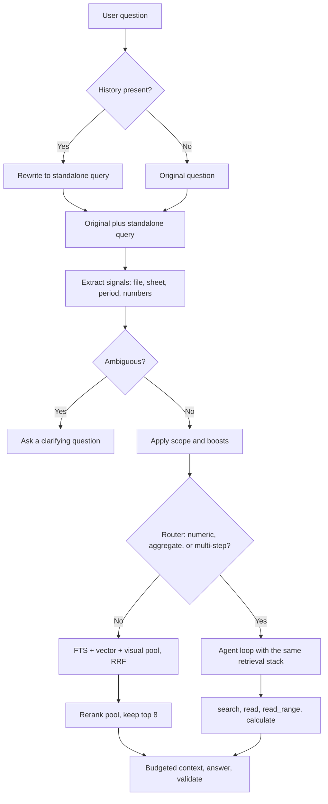
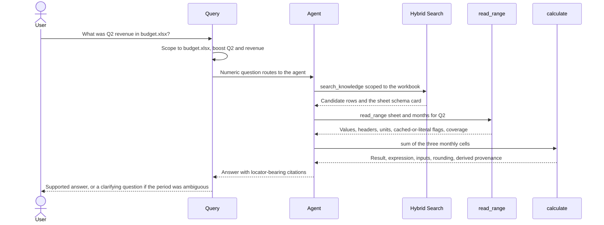

# Query Understanding and Retrieval

Status: Requirements agreed; implementation approach pending validation. This document was drafted bottom-up from an audit of the current query path and a scan of current retrieval practice. Four design choices were reviewed and decided with the user and are marked **Decided**. Everything derived from the scan alone is marked **Recommended (pending validation)**: none of it has been benchmarked on Docket's corpus, and part 08 requires that before any claim of improvement. Parts 01–04 defer the retrieval mechanics here ("exact lookup … cite the workbook version and cell or range," "ask for clarification if multiple interpretations remain," "the index finds the right sheet/row/range, values are read deterministically"); this document closes that gap.

## 1. Purpose and scope

Part 04 settles how evidence becomes searchable. This document covers the path from a user's question to the evidence set the model sees: how the question is understood (follow-ups, named files, periods, numbers), how candidates are retrieved, fused, and ranked, how a question is routed between a single retrieval pass and an agent loop, and how spreadsheet questions reach exact values and calculations instead of an approximation read from eight row-sized chunks.

In scope: follow-up handling, query signals, candidate pool and ranking, routing, agent tools, context assembly, and answer-model sampling as it affects retrieval variance. Out of scope, referenced where they constrain this layer: whether an answer's claims and numbers are actually supported by the cited evidence, abstention thresholds, and the citation label format (part 07); chunking and index construction (part 04); the evaluation harness and benchmark design (part 08); how the UI asks clarifying questions (part 10).

## 2. Current implementation (verified against source)

| Component | Location | Behavior |
| --- | --- | --- |
| Router | `backend/src/docket/services/query/classifier.py` (`_AGENT_PATTERNS`, line 72; `_FALSE_POSITIVE_PATTERNS`, line 175; `classify`, line 200) | A pure-regex `HeuristicQueryClassifier`, no LLM. About 32 patterns (compare, difference between, over the years, why did, list all, across, …) route to AGENT unless a false-positive carve-out matches (physics-quantity phrasings added after misroutes in the physics eval). Default is FAST. "How many", "total", "sum", and numeric questions are never routed to AGENT. A `QueryClassifier` protocol exists so an LLM classifier could be swapped in; none exists. |
| Fast path | `services/query/service.py` (`_ask_fast`) | One `hybrid_search` on the literal question, top 8; if nothing is retrieved, abstain without an LLM call; otherwise resolve chunks, build `Context:\n…\n\nQuestion: …\n\nAnswer:` and call `gateway.generate`. |
| Agent path | `services/agent/graph.py`, `tools.py`, `policy_gateway.py` | LangGraph over two tools: `search_knowledge(query)` (line 54, returns only chunk ids and RRF scores) and `read_evidence(chunk_id)` (line 91, returns text, locator-less citation label, heading). Limits `max_agent_iterations = 4` and `max_agent_tool_calls = 8` (`core/config.py`); a forced `read_evidence` before answering. Citations may come only from chunks actually read. The agent path runs two-way fusion only and ignores the visual leg. |
| Follow-ups | `services/query/conversation.py` (`DEFAULT_MAX_TURNS = 6`, `DEFAULT_MAX_CHARS = 6000`), `query_flow.py` | History is trimmed and passed to the answering model only "for resolving references." Retrieval always uses the literal latest question, so "what about September?" is searched as written. In agent mode the model writes its own search queries, which is implicit rewriting. |
| FTS leg | `infra/retrieval/hybrid.py` (`_sanitize_fts_query`, `fts_search`) | Lowercase, split on `\w+`, drop a small stopword list, double-quote each term and join with `OR` (an AND form once returned zero rows and silently collapsed hybrid to vector-only), rank by `bm25`. Porter stemming is applied by the FTS5 tokenizer. No phrase or proximity queries and no column weighting. A value like `J-01` becomes `j` and `01`. |
| Vector and visual legs | `hybrid.py` (`vector_search`, `visual_search`) | Embed the literal query with no task instruction; LanceDB search pre-filtered to eligible versions (part 04 §6). The visual leg runs only when `settings.visual_index_enabled` (default off) and only on the fast path. |
| Fusion and pool | `hybrid.py` (`_DEFAULT_RRF_K = 60`, `hybrid_search`) | Plain, unweighted reciprocal rank fusion. Each leg requests `top_k = 8` (`default_top_k`), so the candidate pool is at most 24 before fusion and the output is `fused[:8]`. There is no larger pool, no reranker, no diversity or per-document cap, no score threshold, and no neighbour or parent-section expansion. |
| Query-time filters | `hybrid.py` | Only correctness filters: source `ACTIVE`, version `READY`, and `evidence_version_id` eligibility. No file, sheet, date, or document-type filter exists on `hybrid_search`, `search_knowledge`, or `QueryService.ask`, and nothing is parsed from the question (file names, years, months, fiscal periods, numbers, units). |
| Context assembly | `services/query/citations.py` (`build_context_block`) | Each chunk renders as `[basename #chunk12]` plus `Chunk.text`, in fused order. No heading, sheet, row, or page metadata beyond the label, and no token budgeting in code. `num_ctx = 8192`, `num_predict = 4096` (`config.py`); Ollama truncates silently above the window (the cause of an earlier `context_truncation` failure class). |
| Answer sampling | `infra/inference/gateway.py` (`generate`) | Passes only `num_ctx` and `num_predict` by default. No `temperature` and no `think` option on the answering path, so `qwen3:14b` answers at default sampling in default thinking mode (the agent graph does set `temperature=0`). |
| Citations and abstention | `services/query/service.py` (`_finalize_answer`), `citations.py`, `prompts/shared.py` (`ABSTENTION_PHRASE`, line 26) | Validation is label-presence only: at least one valid tag, no unknown tags, one repair retry, then fail closed to `"I don't know based on the available evidence."` There is no relevance threshold, so on the fast path, where FTS is OR-based and the vector leg always returns neighbours, abstention on out-of-corpus questions depends on the model obeying the prompt. Nothing checks a stated number against the cited text. |
| Spreadsheets | `infra/parsing/xlsx_chunker.py` | One chunk per populated row with `Header: value` lines, formula/cached-result annotations, and a `locator_json` of sheet and range. A numeric question goes through the same top-8 search; the model does any sum, average, or conversion in its head; aggregation is limited to at most eight row-chunks with no completeness guarantee; there is no calculation tool; the citation label carries neither sheet nor row. |
| Tests and eval | `tests/unit/test_query_classifier.py`, `test_hybrid_retrieval.py`, `test_query_service.py`, `test_agent_*.py`, `eval/runner.py`, `scoring.py` | Eval records recall@k, fact-in-context, and failure classes; gold spans are matched by normalized substring, not chunk id. The public gold set (33 questions) has no numeric, multi-document, follow-up, out-of-corpus, or revoked cases yet. |

## 3. What parts 01–04 already assume of this layer

| Requirement (source) | What it assumes | Current support |
| --- | --- | --- |
| "Identify the correct financial year, sheet, month, and revenue field … ask for clarification if multiple interpretations remain" (01 §1) | The question is parsed for period, metric, and file, and ambiguity is detected before answering | Nothing is parsed; ambiguity is invisible to retrieval |
| "Retrieve the exact value, including currency and units … cite the workbook version and cell or range" (01 §1, 02 §4) | A deterministic read by locator, and a citation that names sheet and range | Values come from chunk text read by the model; labels carry no sheet or range |
| Docket calculations through an allow-listed calculator that records expression, inputs, units, rounding (02 §4) | A calculation tool and `derived` provenance | No tool; the model computes in its head |
| Answers distinguish latest-synced, checked-online, and unverifiable freshness (01 §4) | Retrieval can report which version and sync state supplied each chunk | Version eligibility is enforced (04 §6), but freshness is not surfaced to the answer |
| "Partial parses must not masquerade as complete, especially for 'all items' or totals questions" (02 §6) | Aggregations carry a coverage statement | Aggregation is bounded by top-8 chunks with no coverage signal |
| "Abstain when an answer cannot be verified" (01 §9) | A retrieval-side no-evidence signal feeding abstention | No threshold or relevance score; abstention is model-only |
| Follow-up history handled without treating prior answers as evidence (existing prompt rule) | Retrieval for a follow-up reflects the conversation | Retrieval ignores history |

## 4. What current practice implies

Findings from primary sources and recent papers. These are evidence about other systems and datasets, not measurements of Docket.

- **Query rewriting is a complement, not a replacement.** A 2026 study on strong RAG baselines reports that rewriting alone is "at best competitive," but that fusing complementary rewrites raised HIT@10 by 12.5 points on an enterprise benchmark and lowered it by 2.4 points on a naturally unambiguous one; a confidence-gated router captured roughly half the gain while rewriting fewer than 40% of queries. [arXiv 2609.05637](https://arxiv.org/abs/2609.05637) Practical guidance converges on rewriting for conversational follow-ups first and using HyDE alongside, never instead of, the original query. [Production guidance](https://dev.to/gabrielanhaia/hyde-multi-query-decomposition-which-query-rewrite-actually-moves-recall-1m08)
- **Route by complexity.** Adaptive RAG puts a complexity classifier before retrieval so single-fact lookups skip the agent loop, which one analysis puts at roughly 2.5× the cost of a single pass; multi-step and cross-source questions go to the loop. [Agentic RAG routing](https://ecorpit.com/agentic-rag-vs-classic-rag-adaptive-routing-cost-2026/)
- **Reranking has mixed evidence.** Qwen3-Reranker-0.6B scores 65.80 on MTEB-R against 57.03 for BGE-reranker-v2-m3 and uses yes/no logit scoring with an optional task instruction (reported 1–5% gain); it needs `transformers` or vLLM rather than a hosted provider. [Model card](https://huggingface.co/Qwen/Qwen3-Reranker-0.6B) A local-first hybrid retrieval system built on SQLite FTS5 reports that cross-encoder reranking, among other post-fusion refinements, "failed to improve NDCG," while per-query IDF-adaptive fusion weights improved on fixed RRF weights. [vstash, arXiv 2604.15484](https://arxiv.org/abs/2604.15484)
- **Spreadsheets.** Recent work treats a spreadsheet as two-dimensional data that must be flattened into text with its structure intact; semantic cell-role annotation helped answer generation more than retrieval. [arXiv 2609.20732](https://arxiv.org/abs/2609.20732) Agentic retrieval over workbooks replaces single-pass search with an iterative tool-calling loop. [arXiv 2603.06503](https://arxiv.org/abs/2603.06503)
- **Numbers.** LLMs misquote and mis-compute figures even when the evidence is in context; delegating computation to verifiable calculators is the standard mitigation. [arXiv 2503.17550](https://arxiv.org/pdf/2503.17550)

## 5. Follow-ups and query rewriting

**Decided: rewrite follow-ups only.** When a conversation has history, one local-model call turns the latest question into a standalone query using only the preceding turns. Retrieval then runs on both the original and the standalone query, and both result lists enter fusion. The answering model still receives the original question and the trimmed history, the rewrite is never presented as evidence or cited, and both forms are recorded in the run record. The first turn is never rewritten. If the rewrite call fails or returns nothing usable, retrieval falls back to the original question. The rewrite instruction forbids introducing facts, entities, or periods that are not in the history or the question. The call runs with `temperature = 0` and thinking disabled, on a configurable `rewrite_model` that defaults to the generation model.

**Implemented, and measured neutral so far.** The rewrite runs on the fast path only, never on the first turn, with the citation tags stripped from the history it sees, and any failure (error, empty output, several lines, over 300 characters, the abstention phrase, or no change) falls back to the original question. The answering prompt and context are unchanged and the rewrite is recorded but never cited. On `qwen3:14b` the rewriter resolved ellipsis correctly and added nothing invented ("what about September?" became "What was actual total revenue in September 2025?", and a topic-switch probe came back essentially unchanged), and thinking off at temperature 0 gave the same rewrites as temperature 0.6 in 0.1–0.6 seconds. Thinking on returned an empty response at `num_predict = 128` because thinking tokens consume the budget, and with a larger budget it cost 3–20 seconds and recalled no more, so the shipped defaults are thinking off and temperature 0, the opposite of the answer path's measured defaults (§9). The end-to-end effect on the six extended-set follow-up questions was nil: 2 of 6 pass with the rewrite on and off, and no gold chunk that the original question missed was recovered. The four failures are retrieval misses for a reason a query rewrite cannot fix: spreadsheet row chunks carry a month but no fiscal year (`Month: Jul`), so a correctly resolved "July 2025" has nothing to match, and the failures need period text in the indexed chunks (§6) or a wider pool or reranker (§7). In one retrieval-only measurement the extra lists displaced a gold chunk, and a question containing "compare" is routed to the agent path, where the rewrite does not apply. The rewrite therefore stays on as decided, at a cost of one short call per follow-up, but its benefit has to be re-measured once the chunks carry period text, and the agent path's lack of a rewrite stays an open gap (§8).

**Recommended (pending validation):**

- Gate the rewrite with a cheap deterministic check (very short questions, pronouns or ellipsis such as "what about", "and for", "that") so context-complete follow-ups skip the extra call, and measure whether the gate loses recall.
- Multi-query expansion, HyDE, and decomposition are not part of this decision. The cited evidence says they help on some data and hurt on unambiguous questions; they are candidates for part 08 behind a confidence gate, not defaults.
- Apply the embedding model's query-side task instruction to the vector leg's query (a counterpart of the manifest field in part 04 §7), measured as a separate change.

## 6. Query signals: scope, boost, clarify

**Decided: scope retrieval on explicit names, boost the rest, and ask when ambiguous.** A deterministic extractor, with no model call, reads the question for:

- **File and sheet names**, matched against the basenames and stems of eligible versions and against sheet names recorded in unit locators. A mention scopes retrieval to the matched file or sheet only when it is explicit and unambiguous: the stem or extension appears as written, or a normalized multi-token name matches exactly one eligible file. The scope is applied as an intersection with the eligible-version set that part 04 §6 already passes to the vector and visual prefilter, and as the same restriction on the FTS query, so scoping is a filter before top-k, not a post-hoc drop.
- **Periods, months, fiscal-year forms, and quarters** (for example `FY 2025–26`, `2025-26`, `Q2`, `August`) and **numbers with units**, which become soft boosts: extra normalized terms in the lexical query and a weight, never a filter.
- **Ambiguity**, such as two plausible fiscal-year readings or several files matching a name, which produces a clarifying question instead of a guess, as parts 01 §1 and 02 §4 require.

If a scoped search returns nothing, Docket says it found nothing in the named file and offers to search everything; it does not widen silently. A topical mention without an explicit name ("the budget") boosts but never scopes. The exact matching thresholds are decided by measurement, not here.

**Implemented and measured: sheet and period context in the indexed text.** The first measurement of the spreadsheet questions found the dominant failure was not ranking or rewriting but missing words: a row says `Month: Jul`, the fiscal-year label lives only in the file name (which the lexical tokenizer splits into pieces such as `fy2025` and `26`, so a bare `2025` never matches), and the units sit on a separate Notes sheet. A deterministic, bounded context list is now built at chunking time from what the workbook itself states (fiscal-year labels in forms that tokenize well, keyword-filtered notes and title lines, full month names for abbreviated months, and the year of a real date cell), stored in the unit locator, and rendered as a `Context:` line in the indexed text only, with `Chunk.text` unchanged. A fiscal-year label combined with a month is never turned into a calendar year, since a fiscal calendar is not guessed (part 02 §4); the Notes sheet's own statement that the fiscal year runs April to March is carried as written. On the extended gold set, retrieval-only hit@8 rose from 31/44 to 39/44 and hit@3 from 23 to 36, and end to end strict accuracy rose from 65.5% to 81.8% (45/55), retrieval recall@8 from 70.5% to 88.6%, wrongful abstention fell from 31.8% to 11.4%, numeric questions went from 13/24 to 18/24, and follow-ups from 2/6 to 5/6 once the step-2 rewrite had period text to match. The original design-document set stayed at recall@8 100% with no wrongful abstention. The ten remaining failures are six retrieval misses and four generation errors (wrong arithmetic or units from retrieved evidence). Known limits: workbooks ingested before this change keep their old locators until their rows are re-chunked, because an unchanged content hash is skipped, so a re-chunk path (part 04 §5) is still needed for existing data; the Expenses workbook's merged title row is still taken as the header, so its months are not expanded; and a question such as "July 2025" matches both fiscal-year workbooks through the token `2025`, which is the ambiguity part 02 §4 says should end in a clarifying question.

**Implemented and measured: explicit scoping, ambiguous-period answers, and number matching.** A question scopes retrieval to one indexed file only when it names the file explicitly: the full file name with its extension, the full stem in quotes, or the full stem next to a file noun such as "workbook" or "memo", with at least two tokens in the stem and never as a fragment of a longer name (so `Revenue-FY2025-26` does not scope to `Revenue-FY2025-26-Budget` unless the question disambiguates). Topical words never scope: "August revenue in FY2025-26" boosts but does not restrict. The scope is intersected with the eligible-version prefilter and added to the lexical query's SQL before top-k, so it cannot widen eligibility, and a scoped file with nothing searchable yields a "nothing was found in this file" answer instead of a silent widening. Sheet-level scoping is not built. When no period is stated (a fiscal-year label, a four-digit year or range, or Q1–Q4/H1/H2; a bare month is not enough), no file is scoped, and the retrieved evidence holds same-named sheets from workbooks of different fiscal years, the fast path adds a pinned note to the prompt asking for each fiscal year's value with its source and with units taken verbatim from the workbook's own notes, and for a closing question about which year was meant. Docket has no interactive clarification flow yet (part 10), so this is a both-answers reply that ends in a question, which also satisfies the extended set's ambiguous-period questions. In a controlled on-versus-off run all four ambiguous-period questions passed with the note and three failed without it, and the five file-scoped questions passed either way, with the scoped runs retrieving only chunks from the named file. The first version of the note let the model rescale 8,660 (INR thousands) into 8,660,000 INR, so the pinned text now forbids rescaling and converting units. Numbers with thousands separators in a question (`6,545,000`) now also match their raw stored form in both the lexical and the vector query. In the full gold-set run the total stayed at 46 of 55 (83.6%) while the composition moved: multi-document questions rose from 7 to 8 of 9, and one agent-path follow-up that is flaky between runs fell. Known gaps: actual against budget within one fiscal year is a different ambiguity this detector does not see, so a budget-only question such as "the budgeted June revenue" can end with an unnecessary "which fiscal year?"; Q1 and H1 count as a period even though they are ambiguous across fiscal years; and the detector needs the fiscal-year labels that the period context (above) puts in the unit locator.

**Recommended (pending validation), as the retrieval-side counterpart of part 04 §10:** normalized numeric tokens so `1,234.56` and `1234.56` match, cell addresses in the indexed text, and a per-sheet schema card (headers, table boundaries, units, period labels) as an extra unit so the sheet is found before any row. These change what is indexed, so they ship with a `docket reindex` path and a gold-set retrieval run, as part 04 §14 requires.

## 7. Candidate pool, fusion, and reranking

**Decided: add a local reranker stage.** The reranker scores a wider candidate pool and replaces the final ordering. The pool grows from 8 per leg to a larger bounded value (30 per leg is the working number) before fusion, and the final context stays at 8 chunks.

Facts that constrain it, verified on the development machine (an AMD Radeon RX 9070 XT with 16 GB of VRAM under ROCm; Ollama runs on it):

- **Runtime options.** The installed Ollama (0.32.15) has no rerank endpoint (`/api/rerank` returns 404). Two routes remain. (a) In-process through `transformers`, already installed as a transitive dependency: but the `torch` in the Docket environment is a CUDA build (`torch.version.hip` is `None`), so it runs on CPU unless a ROCm build of `torch` is installed, which is a large, Linux-specific, per-GPU-generation dependency that does not fit a `pipx install` distribution. (b) Through Ollama's generate API, which does return token log-probabilities: a pointwise yes/no relevance judge scores the probability of "yes" against "no" on the GPU, using either a GGUF reranker model (none is installed; availability of a suitable one in the Ollama library is unverified) or a generation model that is already installed.
- **Cost, measured.** On short probes of about 330 tokens per pair, Qwen3-Reranker-0.6B on 16 CPU threads took about 310 ms per pair and the Ollama judges on the GPU took about 31 ms (`qwen3:14b`) and 18 ms (`qwen3:8b`). On the real gold-set pools, whose chunks are longer, the unoptimised figures were about 0.55 s per pair on CPU (about 16 seconds for a 30-chunk pool, with a peak resident memory of about 12 GB in the experiment process), about 130 ms per pair for `qwen3:14b` (about 4.0 seconds per pool) and about 79 ms per pair for `qwen3:8b` (about 2.4 seconds per pool) on the GPU, all with sequential calls and a warm model; a cold model load adds to the first query. The GPU figures hold only on a machine like this one: hardware tiers belong to part 09, and a CPU-only machine would pay many seconds per question or have to leave the stage off.
- **Probes, superseded by the measurement below.** A padded synthetic probe on the CPU reranker scored a title-only chunk at 0.785 and the answer-bearing row at 0.054 for "What is the current project status of the Local-First Work Intelligence System?". That separation does not occur in the real pipeline, because after the part 04 §9 fix the answer row sits inside the cover-page chunk together with the title, so the probe tested a chunking state that no longer exists. What the probes did show is that probabilities from a yes/no judge saturate to about 0 or 1, so candidates should be ordered by the logit margin between "yes" and "no", not by the probability.

**Measured on the public gold set.** A read-only experiment ingested the six design documents (191 chunks) and, for each of the 33 answerable gold questions, took a 30-chunk pool from `hybrid_search(top_k=30)` and reranked it four ways: A, Qwen3-Reranker-0.6B on the verbatim chunk text (CPU); B, the same on the prefixed index text (part 04 §8); C, `qwen3:8b` as a pointwise judge through Ollama; D, `qwen3:14b` the same way. "Hit" means the best-ranked chunk that contains a gold span; "worse" counts questions whose best gold chunk moved down.

| Variant | hit@8 | hit@3 | MRR | worse | seconds per pool |
| --- | --- | --- | --- | --- | --- |
| Fused pool order (no rerank) | 32 | 30 | 0.779 | n/a | 0 |
| A, 0.6B reranker, raw text | 33 | 33 | 0.980 | 1 | about 16 (CPU) |
| B, 0.6B reranker, prefixed text | 33 | 33 | 0.970 | 0 | about 16 (CPU) |
| C, `qwen3:8b` judge, raw text | 33 | 31 | 0.899 | 5 | 2.4 (GPU) |
| D, `qwen3:14b` judge, raw text | 33 | 33 | 0.955 | 1 | 4.0 (GPU) |
| D, prefixed text | 33 | 33 | 0.985 | 0 | 4.0 (GPU) |
| A with the protected blend | 33 | 32 | 0.878 | 0 | about 16 (CPU) |
| D with the protected blend | 33 | 31 | 0.920 | 0 | 4.0 (GPU) |

How to read it, and what it cannot show:

- **The hit@8 gain is one question, and it is relative to the wider pool.** The only question that changes top-8 membership is `draft-e54e1ab5`, from fused rank 9 to rank 1 in every unprotected variant. The 32/33 baseline is plain fusion over a 30-per-leg pool; the product's current 8-per-leg pool retrieved all 33 in the full end-to-end gold-set run made after the part 04 §9 fix, so on this set the plain pipeline had no miss for a reranker to repair. Widening the pool without a reranker would therefore cost that hit, so the wider pool and the reranker go together. The reranker is not a gain over today's behavior on this set.
- **The rank gains are real in direction but headroom is small.** The best gold chunk is already at rank 3 or better for 30 of 33 questions; the MRR rise from 0.78 to 0.96–0.98 comes from moving the same chunk up a few places (for example `draft-69871a0e` from 6 to 1 and `draft-e690796d` from 4 to 1). It would matter for a context smaller than eight chunks or for answer quality, which this retrieval-only run does not measure.
- **The 8-billion-parameter judge is unstable.** It pushed correct rank-1 chunks down on five questions. The 0.6B reranker and the 14-billion-parameter judge rarely demoted a rank-1 chunk. A, B, and D are indistinguishable at this sample size, and prefixing the text made no consistent difference.
- **The protected blend removes most of the downside and most of the upside.** It reaches zero or one worse cases but lowers MRR to 0.88–0.93 and the hit@3 count to 31–32.
- **The set is too easy and partly duplicated.** It has 33 questions of single-fact, enumeration, and table-lookup types; several gold spans appear in near-identical cover chunks of several documents, which inflates hit rates; and it has no multi-document, follow-up, revoked, or unanswerable questions. Whether a distractor chunk gets promoted above the answer, as the outside literature warns, is exactly what a set this easy cannot detect.

The measurement therefore neither supports making the reranker the default nor shows that it hurts. It shows a clear cost: a few seconds per question on a GPU like the development machine's and many more on CPU.

**Recommended (pending validation), safeguards for the decision above:**

- Choose the mechanism by measurement, with a preference for the Ollama log-probability route: it adds no dependency, uses the GPU the user already has for the other models, and keeps one runtime. Keep the in-process `transformers` route as the fallback for machines where it is the better option, and treat a dedicated reranker model versus an installed generation model as the open choice within route (b).
- Ship the reranker behind a configuration flag and make it the default only if the gold-set retrieval run shows no regression against the plain fused order.
- Protect the top fused ranks with a position-aware blend instead of letting the reranker overwrite them outright, so a reranker disagreement cannot bury a strong retrieval hit.
- Evaluate adaptive per-query IDF weighting of the legs (the vstash result) as an alternative or complement to a cross-encoder, since it adds no inference cost.
- Run the reranker on the question and the verbatim chunk text and, separately, on the prefixed index text (part 04 §8), and keep whichever the measurement favors.
- Neighbour-section expansion (pulling adjacent chunks of a matched section) is a separate option, not chosen here.

## 8. Routing, structured tools, and the agent loop

**Decided: route numeric and aggregate questions to the agent and give it deterministic tools.** The heuristic router stays (no LLM classifier), but its pattern set gains numeric and aggregate phrasings ("how many", "total", "sum", "average", "per month", "year over year", "across sheets", "all rows where") which today never route to AGENT, with false-positive carve-outs reviewed against the physics-eval cases that motivated the current ones. The agent path adopts the same retrieval stack as the fast path (rewrite, scope, wider pool and reranker, and the visual leg when enabled) instead of its current two-way fusion.

The agent gains two tools alongside `search_knowledge` and `read_evidence`:

- **`read_range`**: a deterministic read of a sheet and cell range from the retained workbook bytes in the evidence store, pinned to one evidence version. It returns the values together with their headers, units, number formats, hidden/filter state, and whether each value is literal or a workbook formula's cached result (02 §4), plus a locator-bearing citation. It never reads from an unpublished or superseded version.
- **`calculate`**: an allow-listed operation (sum, average, difference, ratio, percentage change, min, max, count) over resolved input references, which rejects division by zero and incompatible units and records the expression, inputs, units, and rounding. Its output carries `derived` provenance (03 §7). It is not a general code interpreter.

Aggregations scan rows through `read_range` with an explicit coverage statement (rows read of rows in range, hidden rows noted), so a total never silently covers only the rows that happened to be in the top 8 (02 §6). How the answer-side checks use those locators, and how the citation label gains sheet and range, belongs to part 07; this document defines the tool contracts and the routing.

**Implemented, measured, and the routing decision reversed.** The two tools exist and are tested: `read_range` reads a sheet range from the stored workbook bytes of a READY version of an active source (values with headers and number formats, hidden rows, formula text separate from the cached value with a missing cache reported as such and never as zero, units taken from the workbook's own notes, a coverage report capped at 200 cells and 60 rows, and the overlapping row chunks' citation labels, with ranges clipped to the sheet's used area after a first run showed the model asking for `A3:F100` on a six-row sheet and drowning in blank rows), and `calculate` runs an allow-listed operation over cells that it resolves itself, so the model cannot supply a number (Decimal arithmetic, refusal of blank, text, no-cache and mixed-unit inputs and of division by zero, `derived` provenance). Their chunk ids are citable, `read_range` satisfies the forced-read rule, the agent path now shares the follow-up rewrite, the visual leg and the scope with the fast path, and the iteration and tool-call limits are 8 and 14. But the design's central step, routing numeric and aggregate questions to the agent, failed measurement. With the tools available, a forced-agent run of the extended set scored 47.3% (26 of 55) against 81.8% (45 of 55) for forced-fast, at about 36 seconds per question against 14. Across the 55 agent runs the model made 67 searches and 69 evidence reads but only 2 `read_range` calls and no `calculate` call. It typically searched once, read only the top hit, and answered or abstained, which loses whenever the answer lives in a different workbook, fiscal year or row than the top hit, whereas the fast path puts all eight chunks in context. The tools therefore raise the ceiling on number accuracy only if they are called, and the free agent loop on a 14-billion-parameter local model does not call them. The router's patterns are unchanged, numeric questions stay on the fast path, and the tools are kept as tested but unrouted infrastructure. Two facts also reduce the value of this step on the current gold set: of the four generation errors left at that point, three were the ambiguous-period questions (a disambiguation problem, since fixed above) and only one was arithmetic. Candidate next moves, none built: a deterministic compute stage in the fast path (retrieve as today, have the model emit a small JSON plan of an operation over cells from the retrieved chunks, run `calculate`, answer from the result); seeding the agent's first turn with the fast path's eight chunks and measuring again; or leaving arithmetic to the model until a harder numeric gold set shows it matters.

**Recommended (pending validation):**

- The agent limits were raised from 4 iterations and 8 tool calls to 8 and 14, because a search, a read, a range read, a calculation, and a final answer exceed the old limit and an agent that reaches the limit with a pending tool call produces an empty answer and abstains. In the forced-agent measurement no run hit either limit, so the limits were not what held the agent back.
- Keep an LLM-based router as a later option behind the existing `QueryClassifier` protocol, adopted only if the regex router's misroute rate on the extended gold set justifies it.

## 9. Context assembly and answer sampling

**Recommended (pending validation):**

- **Budget before sending (implemented).** The prompt is counted with the token counter from part 04 and the lowest-ranked chunks are dropped, never below one, to fit `num_ctx` minus a reserve, instead of relying on Ollama to truncate silently; history counts in the same budget, and a dropped chunk is recorded and is not a valid citation. The embedding tokenizer only approximates the generator's, so the reserve doubles as the safety margin. The agent path does not apply it, because its chunks arrive in read order and not in rank order.
- **Richer context blocks (implemented).** Each chunk gets a `Location:` or `Section:` line between its citation label and its text, built from the stored unit locator (heading path, sheet and range, slide and shape, page span) without modifying `Chunk.text`, with brackets and `#` removed so it cannot match the citation-tag pattern, and the system prompt tells the model the line is metadata and not evidence to quote. An ablation that removed the line was slightly worse, not better, on the original gold set, so it stays.
- **Explicit sampling (implemented, and the first recommendation was wrong).** The fast path and the citation-repair retry now pass sampling explicitly and strip a leading `<think>` block from the response, but the recommended values failed measurement on the public gold set with `qwen3:14b`. Thinking off made a correct, retrieved answer (the `RETRY_WAIT` transitions question) fail three runs of three and a gate-name answer terse and imprecise, while cutting latency from 8–18 seconds to 0.3–3 seconds. Temperature 0 also cost accuracy with thinking on (strict 29/33 against 31/33, with two judged failures against none), which matches Qwen's guidance that greedy decoding is discouraged in thinking mode. The shipped defaults are therefore thinking on and temperature 0.6, each overridable by a setting, with the latency cost documented. Run-to-run variance from the sampler is accepted and handled by repeats and by reading per-question outcomes, not removed by greedy decoding.

## 10. Hand-offs to other parts

- **Part 07:** a retrieval-side no-evidence signal (a reranker probability or fused score) is available for abstention, but the threshold, the numeric check against cited cells, and the citation label format are designed there.
- **Part 08:** the gold set needs numeric, multi-document, follow-up, out-of-corpus, scoped-file, and ambiguous-period questions before any claim about this layer; the reranker decision depends on it.
- **Part 10:** the interface asks the clarifying questions that §6 produces.

## 11. Diagrams

## 12. Remaining implementation-time validation

The product and design choices in §5–§8 are decided. Everything else here is to verify during implementation:

- **Reranker, before it becomes a default.** Gold-set retrieval (hit@8, rank per question) with and without it, on raw and prefixed text, with and without blending, plus measured end-to-end latency on the target hardware. A regression on any gold question is a finding, not noise to average away (part 04 §14).
- **The extended gold set.** Numeric, multi-document, follow-up, out-of-corpus, scoped-file, ambiguous-period, and revoked questions, written before the features they test, so each change in this document has a measurement and not only the easy single-fact slice.
- **Follow-up rewrite.** Recall with the rewrite on follow-up questions against the original-only baseline, the effect of the deterministic gate, and a check that a rewrite never introduces entities absent from the history.
- **Signal extraction.** The false-scope rate (a named file that was not meant as a filter) and the missed-scope rate on real file names, sheet names, and period phrasings, in more than one language if the target users need it.
- **Router.** The misroute rate of the extended pattern set on the physics cases and on numeric and aggregate questions, and the latency cost of agent routing for them.
- **Ollama options.** That the installed client honors a thinking-off option for `qwen3` on the answering path, and the effect of explicit `temperature = 0` on run-to-run variance.
- **Ollama log-probabilities.** That `logprobs` and `top_logprobs` stay available across Ollama versions and for the chosen model, since the GPU reranker route depends on them, with a clear fallback when they are absent; and that the judge's token variants (`yes`, `Yes`, `no`, `No`) are summed rather than matched on one spelling.
- **Hardware tiers.** The reranker's cost on CPU-only and on non-AMD GPUs, so part 09 can state which tier gets the stage enabled by default.
- **Tool contracts.** `read_range` against workbooks with merged headers, hidden rows, stale formula caches, and external links, and `calculate` against unit mismatches and division by zero, using the cases listed in part 02 §7.

## References

Internal:

- `backend/src/docket/services/query/classifier.py`, `service.py`, `conversation.py`, `citations.py`: routing, fast path, history, context and citation handling
- `backend/src/docket/services/agent/graph.py`, `tools.py`, `policy_gateway.py`: agent loop and tools
- `backend/src/docket/infra/retrieval/hybrid.py`, `resolver.py`: FTS, vector, and visual legs, RRF, chunk resolution
- `backend/src/docket/infra/inference/gateway.py`, `backend/src/docket/core/config.py`: generation options, top-k, context and agent limits
- `backend/src/docket/infra/parsing/xlsx_chunker.py`, `backend/src/docket/prompts/shared.py`: spreadsheet chunks, abstention phrase
- `backend/src/docket/eval/runner.py`, `scoring.py`: retrieval metrics and span matching
- `Upgrade/01-sources-and-lifecycle.md`: exact-lookup example, clarification, freshness labels
- `Upgrade/02-parsing-and-multimodal-extraction.md`: deterministic spreadsheet reads, the controlled calculator, coverage
- `Upgrade/03-evidence-storage-and-versioning.md`: unit kinds, locators, provenance
- `Upgrade/04-chunking-and-indexing.md`: version-isolated indexes, the index manifest, the context prefix, spreadsheet indexing, the retrieval-regression gate

External:

- [Better Together: Complementary Query Rewriting Under a Strong RAG Baseline (arXiv 2609.05637)](https://arxiv.org/abs/2609.05637): rewriting as complementary coverage, confidence-gated routing
- [HyDE, multi-query, decomposition: which rewrite moves recall](https://dev.to/gabrielanhaia/hyde-multi-query-decomposition-which-query-rewrite-actually-moves-recall-1m08): practitioner guidance
- [Agentic RAG costs 2.5x classic RAG: the 2026 routing decision](https://ecorpit.com/agentic-rag-vs-classic-rag-adaptive-routing-cost-2026/): adaptive routing
- [Qwen3-Reranker-0.6B model card](https://huggingface.co/Qwen/Qwen3-Reranker-0.6B): scoring method, benchmark figures, deployment requirements
- [vstash: Local-First Hybrid Retrieval with Adaptive Fusion (arXiv 2604.15484)](https://arxiv.org/abs/2604.15484): adaptive fusion, negative reranking result
- [Q&A on Any Spreadsheet Requires Interpreting Its Grid Structure (arXiv 2609.20732)](https://arxiv.org/abs/2609.20732): cell roles, flattening
- [Beyond Rows to Reasoning: Agentic Retrieval for Spreadsheets (arXiv 2603.06503)](https://arxiv.org/abs/2603.06503): tool-calling retrieval over workbooks
- [An LLM-Powered Clinical Calculator Chatbot Backed by Verifiable Calculators (arXiv 2503.17550)](https://arxiv.org/pdf/2503.17550): delegating computation to verifiable tools
