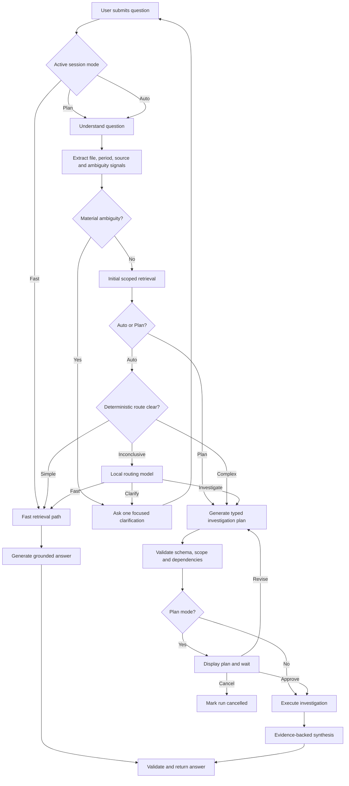
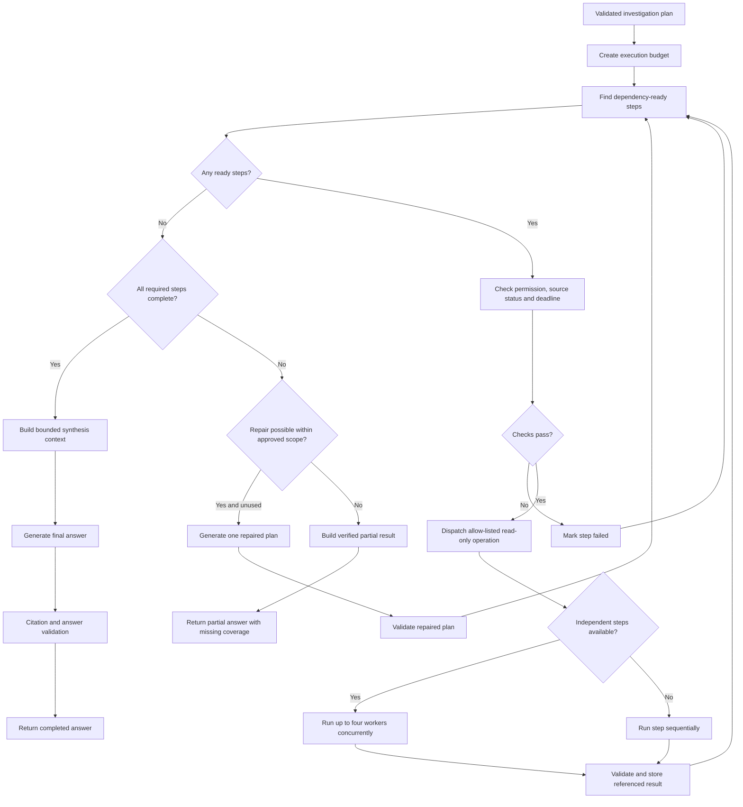
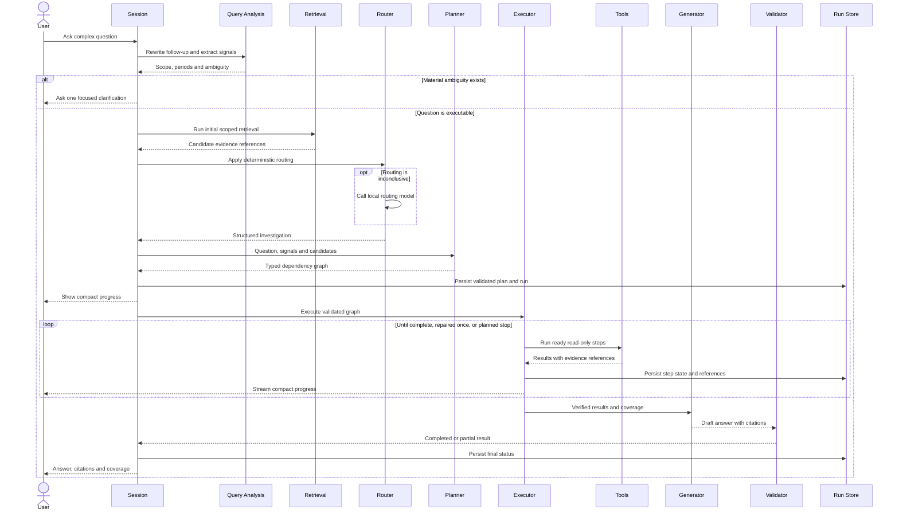
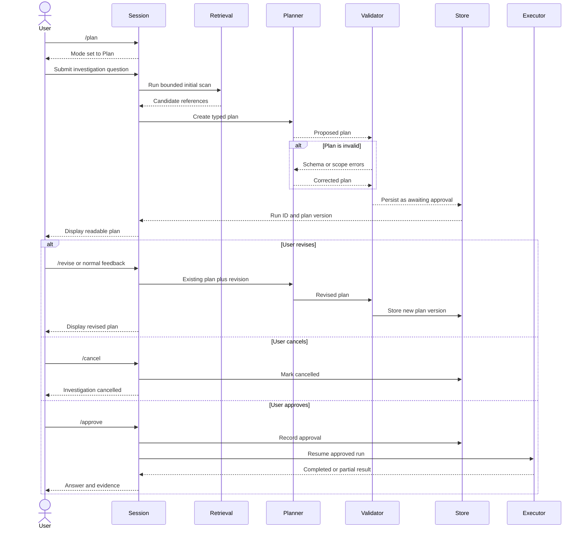
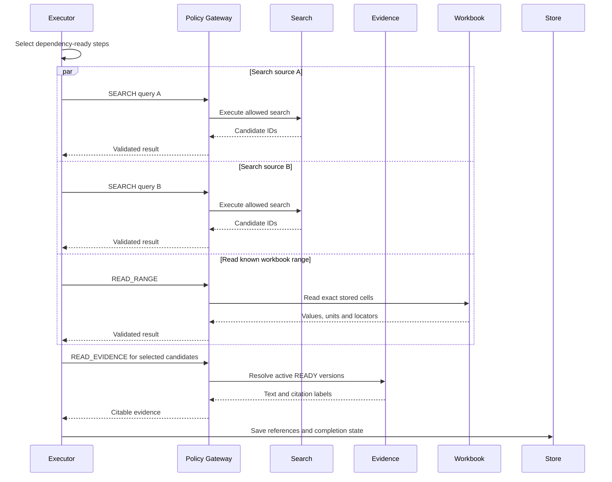
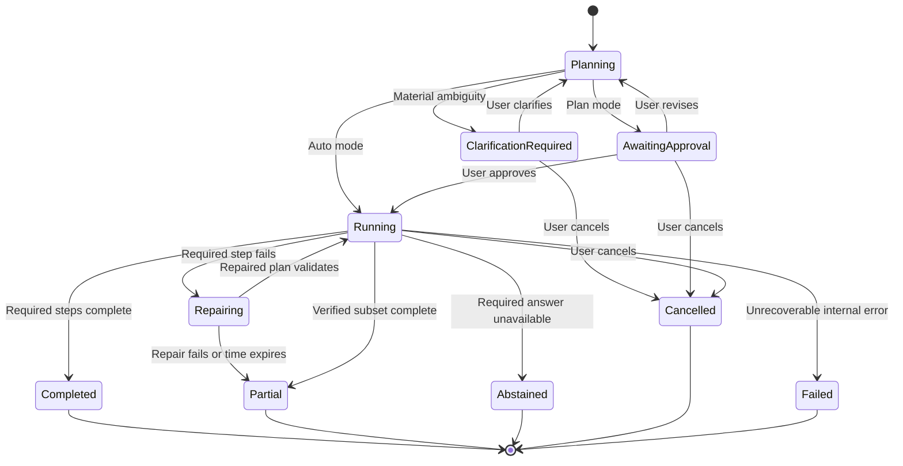

# Reasoning and Agent Orchestration

Status: Requirements agreed; recommended architecture documented; implementation and benchmark validation pending. This document is based on the current Docket implementation, the measurements in part 05, the decisions made during the architecture discussion, and an independent Claude Code review of the repository.

Labels used below:

- **Current** describes verified repository behavior.
- **Decided** records an agreed product or architecture choice.
- **Validation gate** marks a decision that must be measured on the target PC or evaluation set before release.

## 1. Purpose and scope

Parts 01-05 establish how Docket acquires, parses, stores, indexes, and retrieves evidence. This document defines what happens when answering a question requires more than one retrieval-and-generation pass: how Docket chooses an answering mode, prepares and approves an investigation plan, executes read-only tools, repairs incomplete work, reports progress, and preserves enough state for audit and recovery.

The language model may decide what information is needed and how verified results should be explained. It must not directly control unrestricted tools, invent evidence, silently expand the approved scope, or describe an incomplete investigation as complete.

In scope:

- persistent Auto, Fast, and Plan modes;
- routing and clarification;
- retrieval-seeded structured planning;
- plan validation, approval, revision, execution, and repair;
- deterministic read-only tool workers and bounded parallelism;
- deadlines, cancellation, partial results, and recovery;
- progress events and durable investigation records;
- rollout gates for automatic structured investigation.

Hand-offs:

- claim-level citations, factual verification, and abstention: part 07;
- benchmark construction and scoring: part 08;
- model choice, VRAM residency, inference serving, and deployment: part 09;
- detailed desktop and web interactions: part 10;
- write access to connected systems: future work requiring separate permissions and approvals.

## 2. Current implementation and measured baseline

### 2.1 Current paths

**Current.** `QueryService.ask()` exposes two execution paths:

| Path | Behavior |
| --- | --- |
| Fast | One hybrid retrieval, evidence resolution, token-budgeted context assembly, generation, citation validation, and at most one citation-repair call. |
| Agent | A bounded LangGraph loop in which the model calls `search_knowledge`, `read_evidence`, `read_range`, and `calculate` through an allow-listed policy gateway. |

`HeuristicQueryClassifier` uses reviewable regular expressions. Fast is the default. Comparisons, causal questions, timelines, exhaustive requests, and cross-document phrasing can route to Agent. A caller can also force a route.

The current agent has two enforcement layers: the model is bound only to registered tools, and the policy gateway independently blocks unknown tools and calls beyond the configured budget. It must successfully use `read_evidence` or `read_range` before finishing normally. Citable evidence is reconstructed from successful tool results instead of trusting model-written labels. Current limits are eight iterations and fourteen tool calls.

### 2.2 Why the free tool loop is insufficient

**Current measurement.** Part 05 records the following results on the 55-question extended set:

| Forced mode | Score | Approximate time/question |
| --- | ---: | ---: |
| Fast | 45/55 (81.8%) | 14 seconds |
| Agent | 26/55 (47.3%) | 36 seconds |

Across the forced-Agent runs, the model made 67 searches and 69 evidence reads, but only two `read_range` calls and no `calculate` calls. It usually searched once, read the top result, and answered or abstained. No run exhausted the raised iteration or tool-call limits, so larger limits did not address the failure.

This does not show that multi-step investigation is unnecessary. It shows that the current local model is unreliable at deciding its next tool call inside a free ReAct-style loop. The replacement must separate planning from deterministic execution and must be benchmarked before receiving broader Auto traffic.

### 2.3 Existing components to preserve

- `QueryClassifier` remains the routing interface.
- Query rewriting, explicit file scope, ambiguity signals, and `hybrid_search` remain the shared retrieval foundation.
- The policy gateway remains the final tool allow-list and budget boundary.
- `EvidenceResolver` remains the authority for citable evidence.
- Workbook reads and calculations remain deterministic operations over stored workbook bytes.
- Citations continue to be reconstructed from successful tool results.
- Final answer validation remains fail-closed.
- Active-source and READY-version checks apply to every retrieval and read.

## 3. Product and architecture decisions

### 3.1 Three persistent modes

**Decided.** A mode remains active for the conversation until the user changes it.

| Mode | Commands | Behavior |
| --- | --- | --- |
| Auto | `/auto`, `/mode auto` | Choose Fast, Clarify, or Structured Investigation. |
| Fast | `/fast`, `/mode fast` | Always use the single-pass path. |
| Plan | `/plan`, `/mode plan` | Prepare a plan and wait for approval. |

Plan mode supports `/approve`, `/revise <instruction>`, and `/cancel`. Ordinary text is revision feedback only while a plan is awaiting approval; otherwise it starts a new question.

The user-selected mode and internal route are separate:

```text
UserMode      = AUTO | FAST | PLAN
ExecutionPath = FAST | INVESTIGATION | CLARIFY
```

The current `AGENT` path is transitional. It remains available during migration and evaluation but is not part of the final three-mode product contract.

### 3.2 Retrieval-seeded planning

**Decided.** Complex questions use one planner and deterministic tool workers. The first version does not run multiple LLM subagents. Independent searches, evidence reads, and workbook operations may run concurrently, while model calls remain few and sequential.

The planner does not work from the question alone. Docket first runs deterministic query understanding and initial retrieval. The planner receives:

- the original and standalone question;
- file, source, period, and ambiguity signals;
- the eligible source/version scope;
- a bounded list of candidate IDs, source names, headings, locators, and summaries;
- the allowed step vocabulary and budgets.

This directly addresses the current agent's tendency to inspect only one top result without discovering other workbooks, periods, or rows.

### 3.3 Clarify instead of guessing

**Decided.** Docket asks one focused question before planning when a missing choice materially changes the scope or answer. Examples include an unspecified fiscal year when several match, an ambiguous file, or a metric name with multiple meanings.

Clarification is a first-class result. It is neither an investigation plan nor an abstention. The user's reply resumes query understanding with the additional constraint.

### 3.4 Accuracy and latency

**Decided.** Accuracy is primary, subject to an interactive latency goal:

- target complex-investigation latency: 30 seconds on the target PC;
- planned stop: 45 seconds;
- after the planned stop, no new step starts and Docket returns verified completed findings with explicit missing coverage;
- 45 seconds becomes a true hard cutoff only after inference calls are time-bounded or cancellable.

Part 08 must report p50 and p90 latency rather than only a mean.

## 4. End-to-end architecture

### 4.1 Mode selection and routing



### 4.2 Auto router

**Decided.** Auto routing uses three layers:

1. deterministic signals handle obvious Fast, Investigation, and Clarify cases;
2. a configurable small local model handles inconclusive cases with structured output;
3. invalid or unavailable router output falls back to deterministic behavior.

The router returns reason codes rather than an uncalibrated confidence number:

```text
RouteDecision
  path: FAST | INVESTIGATION | CLARIFY
  reason_codes: list[str]
  clarification_question: str | null
```

**Validation gate.** The separate router is enabled on the target PC only when it meets the routing benchmark, fits alongside the main model without harmful swapping, and improves end-to-end latency. Otherwise the same classifier interface temporarily uses the main model with thinking disabled, temperature zero, and a small output budget. Part 09 chooses the concrete model.

### 4.3 Typed plan

The planner produces a versioned structured plan. It cannot emit executable Python, SQL, shell commands, URLs, arbitrary connector requests, or unknown tools.

```text
InvestigationPlan
  schema_version: str
  run_id: str
  objective: str
  approved_source_ids: list[str]
  success_criteria: list[str]
  steps: list[PlanStep]

PlanStep
  id: str
  operation: SEARCH | READ_EVIDENCE | READ_RANGE | CALCULATE | COMPARE
  objective: str
  depends_on: list[str]
  inputs: object
  expected_output: str
  completion_check: object
```

| Operation | Purpose |
| --- | --- |
| `SEARCH` | Find candidate evidence inside approved scope. |
| `READ_EVIDENCE` | Resolve exact citable chunk content. |
| `READ_RANGE` | Read a range from a pinned workbook version. |
| `CALCULATE` | Apply an allow-listed operation over referenced cells. |
| `COMPARE` | Align already-read results by declared keys without inventing missing values. |

The validator rejects unknown schema versions or operations, invalid inputs, duplicate IDs, dependency cycles, missing dependencies, excessive steps, sources outside approved scope, calculations using model-supplied numbers, and all write operations.

### 4.4 Deterministic execution



Initial configurable ceilings:

- twelve plan steps;
- twenty-four successful tool calls;
- four concurrent non-LLM workers;
- one repaired plan;
- two time-aware retries for transient failures.

Concurrency applies to independent database, index, evidence-store, and workbook operations. Local model calls are not assumed to run concurrently on one GPU. Thread safety must be verified before enabling concurrency above one.

### 4.5 Repair and reapproval

One repair may retry, replace, or add steps only when the user's objective, approved source set, requested metric, requested period, and read-only permission class remain unchanged.

Expanding any of these creates a new plan version. Plan mode returns it to `AWAITING_APPROVAL`. Auto never widens scope silently; it asks the user or returns a partial result.

## 5. Sequence diagrams

### 5.1 Auto-mode investigation



### 5.2 Plan-mode approval and revision



### 5.3 Parallel read-only workers



## 6. Durable execution

### 6.1 Run-state diagram



### 6.2 Persistence model

Durable state belongs in SQLite rather than ad hoc JSON files:

```text
QueryRun
  id, conversation_id, question, user_mode, execution_path
  status, route_reason_codes, deadline_at, completion_summary

QueryPlan
  id, run_id, version, schema_version, objective
  approved_source_ids, success_criteria, approval_status

PlanStep
  id, plan_id, operation, dependencies, sanitized_inputs
  status, attempts, timing, error_category

StepEvidenceReference
  step_id, source_id, evidence_version_id, chunk_id, locator
```

Store plan structure, sanitized parameters, statuses, timings, errors, and evidence references. Do not store chain-of-thought, thinking tokens, full model transcripts, copied email/document bodies, credentials, OAuth tokens, or unrestricted tool output. Thinking blocks are discarded at the inference boundary.

### 6.3 Source lifecycle

**Decided.** Run content follows the lifecycle of referenced evidence:

- every evidence-bearing result references a source and immutable version;
- revocation prevents new resolution immediately;
- hard deletion removes or invalidates related references and cached renderings;
- an old citation never resolves to a different version;
- content-free operational metrics may remain;
- resumed runs revalidate every source and version before continuing.

## 7. Progress, cancellation, and partial results

Auto shows compact progress such as:

```text
Investigating across 2 workbooks
  Completed: located FY2024-25 actual revenue
  Running: reading FY2024-25 budget rows
  Waiting: variance calculation
```

The full plan is available on demand. Raw prompts and hidden reasoning are never shown. Fast retains the current answer experience. Plan displays the complete readable plan and approval state.

The executor checks a monotonic deadline before starting each step. Cancellation prevents new work and marks pending steps cancelled. The current synchronous Ollama call cannot guarantee immediate cancellation, so the inference gateway needs a timeout or cancellable request before the 45-second stop becomes a guaranteed hard cutoff.

A partial answer is allowed only when every displayed finding is supported by successfully resolved evidence and the response states exactly what remains incomplete. If one exact value depends on a failed step, Docket abstains. For “all” or “every” requests, Docket may list verified items but must label the list incomplete. Part 07 defines what qualifies for the user-facing word “verified.”

## 8. Security and permissions

Connected content is untrusted reference material. Instructions inside documents, email, chats, spreadsheets, transcripts, or tool results never change the plan or permissions.

The model cannot:

- execute an operation outside the registered vocabulary;
- submit shell, Python, SQL, URLs, or arbitrary connector calls;
- widen source/version eligibility;
- supply numbers directly to `CALCULATE`;
- convert a read plan into a write action;
- approve its own plan;
- bypass cancellation, revocation, or expiry.

The current phase remains read-only. Future writes require separate risk classes, previews, idempotency, explicit approval, post-action verification, and audit rules. Approval of a read plan never implies write permission.

## 9. Auto rollout and release gates

**Decided.** Automatic investigation expands category by category:

- Auto begins with Fast as the safe default;
- Plan always permits explicit structured investigation;
- initial Auto candidates are benchmarked categories such as cross-document comparison, exhaustive enumeration, and multi-source synthesis;
- numeric and aggregate routing stays disabled until it beats Fast.

A category becomes eligible only when structured investigation:

1. beats Fast on that category across repeated runs;
2. does not regress the existing 33-question and 55-question sets;
3. satisfies part 07's evidence rules;
4. meets the target-PC latency distribution;
5. classifies partial and abstaining outcomes correctly;
6. passes policy and lifecycle tests.

Target-PC router validation measures routing accuracy, warm and cold latency, joint model residency, model eviction/reload time, and impact on end-to-end p50 and p90 latency. If a separate router fails, Docket temporarily uses the main model through the same interface.

## 10. Testing and evaluation

### 10.1 Unit tests

- deterministic routing and reason codes;
- structured router parsing and fallback;
- plan-schema validation;
- duplicate IDs, unknown operations, missing dependencies, and cycle rejection;
- source-scope enforcement;
- referenced-cell-only calculation inputs;
- dependency scheduling and concurrency limits;
- deadlines, cancellation, retries, and repair limits;
- state-transition validation;
- lifecycle cleanup of references.

### 10.2 Integration tests

- a simple Auto question stays Fast;
- a complex Auto question receives an initial scan and validated plan;
- material ambiguity pauses before planning;
- Plan survives approval, revision, cancellation, and restart;
- revocation between approval and execution blocks the step;
- revocation during execution prevents final resolution;
- forged and injected tool names remain blocked;
- parallel reads do not corrupt SQLite or LanceDB state;
- planned stop returns an honest partial result;
- exact-answer failure abstains;
- completed answers cite only evidence earned by successful steps.

### 10.3 Evaluation additions

Part 08 must add repeated cases for cross-document comparisons, timelines, exhaustive requests, workbook calculations, conflicting periods, follow-ups, misleading top hits, missing/revoked evidence, ambiguity, prompt injection, and deadline-driven partial results.

Report route accuracy, task completion, citation validity, fact support, completeness, unnecessary clarification, repair frequency, tool utilization, partial-result honesty, p50 latency, and p90 latency.

## 11. Implementation sequence

**Decided (part 08 §4, spike first).** No infrastructure step below starts until experiment E3 in part 08 §8 has met its threshold: a retrieval-seeded typed plan must beat deterministic fan-out (one retrieval per file or fiscal year from the signals), a seeded agent (the fast path's chunks in the first turn) and forced Fast on the multi-step set, within the latency budget. E3 is an offline script over recorded runs and touches no schema. If it fails, this sequence is revised before code is written. Step 3 below is independent of E3 and may ship first.

1. Define user-mode, execution-path, route, plan, step, result, and run-state types.
2. Add migrations and repositories for runs, plan versions, steps, approvals, and evidence references.
3. Remove per-run mutable state from the shared `QueryService` instance.
4. Package initial retrieval results for the planner.
5. Implement structured planning and deterministic validation.
6. Implement dependency execution using existing tools and the policy gateway.
7. Add Plan commands, approval interrupts, revision, cancellation, and resume.
8. Add progress events and compact rendering.
9. Add time-budget propagation and cancellable/time-bounded inference.
10. Build the multi-step benchmark and validate Plan.
11. Validate router models and resources on the target PC.
12. Enable Auto investigation one category at a time.

## 12. Hand-offs

- **Part 07:** claim-to-evidence validation, numeric verification, conflicts, “verified,” partial answers, and abstention.
- **Part 08:** multi-step gold set, repeated-run methodology, category gates, latency distributions, and regression policy.
- **Part 09:** router/planner models, target-PC residency, Ollama cancellation, concurrency, and production budgets.
- **Part 10:** mode selector, plan review, progress, clarification, partial-result, cancellation, and recovery UX.

## 13. References

### Repository evidence

- `backend/src/docket/services/query/service.py`: routing, prompt fitting, citation reconstruction, and answer validation.
- `backend/src/docket/services/query/classifier.py`: heuristic routing and classifier interface.
- `backend/src/docket/services/query/signals.py`: file, period, and ambiguity signals.
- `backend/src/docket/services/agent/graph.py`: bounded agent loop and forced-read rule.
- `backend/src/docket/services/agent/policy_gateway.py`: fail-closed tool enforcement.
- `backend/src/docket/services/agent/tools.py`: current read-only tools.
- `backend/src/docket/infra/evidence/workbook_reader.py`: exact workbook reads and calculations.
- `backend/src/docket/core/config.py`: inference and agent limits.
- `Upgrade/05-query-understanding-and-retrieval.md`: measured Fast/Agent results.

### External primary sources

- [Anthropic: Building Effective AI Agents](https://www.anthropic.com/engineering/building-effective-agents): routing, parallelization, orchestrator-worker, and evaluator-optimizer patterns.
- [Anthropic: Trustworthy agents in practice](https://www.anthropic.com/research/trustworthy-agents): human control, plan review, prompt injection, and privacy.
- [LangGraph: Thinking in LangGraph](https://docs.langchain.com/oss/javascript/langgraph/thinking-in-langgraph): discrete nodes, checkpoints, interrupts, retries, and resume behavior.
- [NIST NCCoE: AI Agent Identity and Authorization](https://www.nccoe.nist.gov/sites/default/files/2026-02/accelerating-the-adoption-of-software-and-ai-agent-identity-and-authorization-concept-paper.pdf): agent authorization and least privilege.
- [Understanding the planning of LLM agents: A survey](https://arxiv.org/abs/2402.02716): planning, task decomposition, reflection, and memory patterns.
