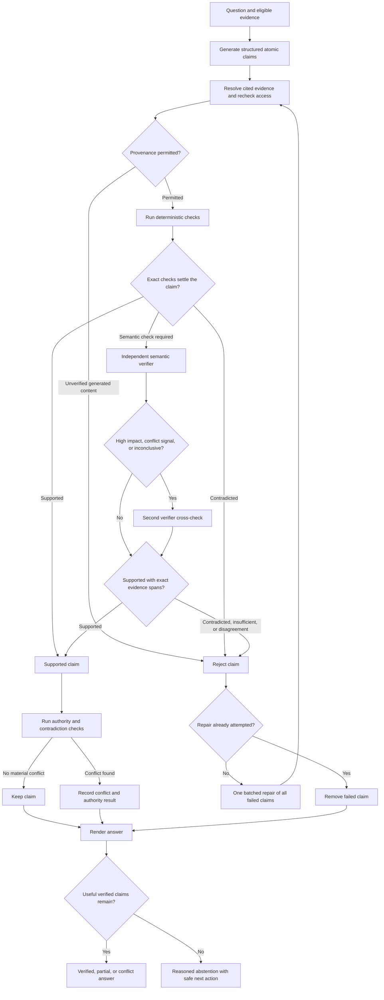
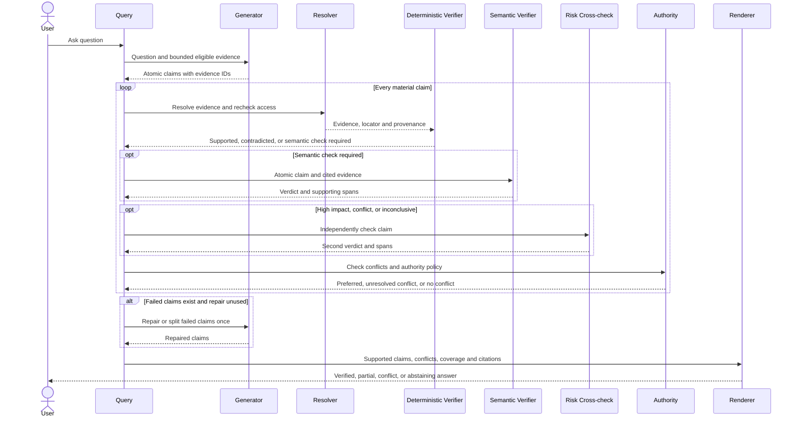
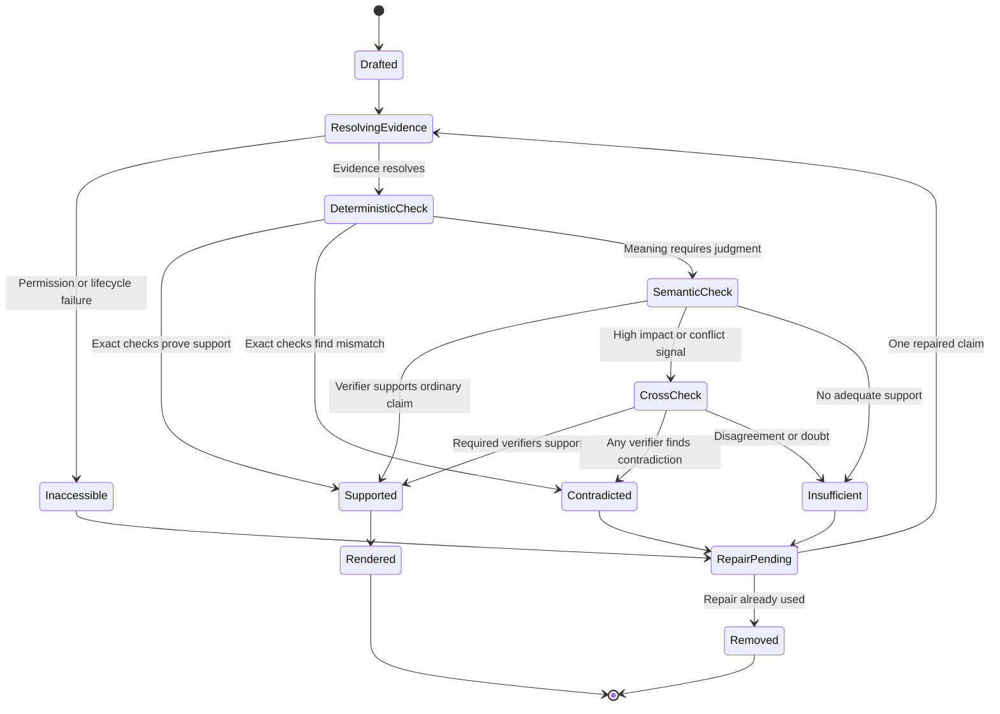

# Citations, Trust, and Abstention

Status: Requirements agreed; recommended architecture documented; implementation and comparative validation pending. This document is based on the current Docket implementation, the decisions made during the trust-design discussion, the contracts deferred by parts 01-06, and a scan of primary research on citation correctness, grounded generation, uncertainty, and abstention.

Labels used below:

- **Current** describes behavior verified in the repository.
- **Decided** records a product or architecture choice agreed during discussion.
- **Recommended** is the proposed implementation subject to measurement.
- **Validation gate** marks a claim or threshold that must be proven on representative Docket data before release.

## 1. Purpose and scope

Parts 01-06 establish the evidence lifecycle and the path from a question to retrieved or investigated evidence. This document defines when Docket is allowed to present an answer as supported.

The existence of a valid citation tag does not prove that its source supports the sentence next to it. A model can copy a valid tag and still invent a number, use the wrong fiscal year, overstate a comparison, or add a causal conclusion. Docket therefore needs a claim-level trust layer between answer generation and user-visible rendering.

This document covers:

- atomic factual claims and claim-level citations;
- deterministic verification of values, units, dates, ranges, and calculations;
- semantic verification for prose claims that code cannot settle;
- conflict detection and explicit source authority;
- partial answers, abstention reasons, and safe next actions;
- generated evidence and derivation provenance;
- citation cards and export behavior;
- calibrated support confidence and evidence coverage;
- diagnostic records, lifecycle enforcement, testing, and rollout gates.

Out of scope:

- retrieval ranking and routing, except where they feed abstention: part 05;
- investigation planning and tool orchestration: part 06;
- construction of gold sets and statistical release reports: part 08;
- concrete verifier models and target-PC deployment: part 09;
- detailed application layouts and interaction design: part 10.

## 2. Current implementation

### 2.1 Citation validation

**Current.** `EvidenceResolver` is the single authority that converts a chunk ID into citable evidence. A resolved item includes its immutable evidence-version ID, source ID, source display name, text, heading, and a human-readable location derived from the stored unit locator.

The model sees labels such as:

```text
[Revenue-FY2024-25.xlsx #a1b2c3d4e5f6]
Location: Revenue-FY2024-25.xlsx > Monthly Revenue, range B8:D8
...
```

`validate_citations()` currently checks:

- exact abstention-phrase matching;
- whether at least one supplied citation label appears in a non-empty answer;
- whether the answer contains citation-shaped labels that were not supplied;
- whether cited evidence remains resolvable before the answer is returned.

If citation attribution is missing or malformed, `_finalize_answer()` permits one repair generation. If the repaired answer is still invalid, Docket replaces it with the fixed abstention phrase.

This protects against uncited answers, invented citation identifiers, and evidence revoked during generation. It does not determine whether a cited passage supports each claim.

### 2.2 Offline semantic judge

**Current.** The evaluation subsystem contains a `ClaimJudge`. It checks paraphrased facts and asks whether every factual claim in an answer is supported by its cited text. It can cross-check with a second model and treats disagreement as doubt.

This judge runs on recorded evaluation artifacts. It is not part of production `QueryService`, so an answer can pass production validation merely by including one real citation even when another sentence is unsupported.

### 2.3 Existing abstention behavior

**Current.** When retrieval returns nothing, evidence disappears, generation is empty, or citation repair fails, the user receives exactly:

> I don't know based on the available evidence.

The result contains an `abstained` Boolean and internal validation warnings. It does not tell the user whether the cause was missing evidence, revoked access, a failed calculation, conflicting sources, or an unsupported generated claim.

### 2.4 Current evidence available for stronger checks

Docket already preserves most of the inputs needed for a stronger trust layer:

- stable source, evidence-version, evidence-unit, and chunk IDs;
- page spans, heading paths, slide/shape locations, and workbook sheet/range locators;
- `verbatim`, `derived`, and `generated` provenance distinctions;
- exact workbook cells, number formats, formulas, cached values, units, and hidden-row state;
- deterministic calculation results tied to input cells;
- active-source and READY-version enforcement.

The trust layer should extend these contracts rather than create an unrelated citation store.

## 3. What “verified” means

**Decided.** Docket may display a material factual claim as verified only when all applicable conditions hold:

1. every cited evidence reference resolves to an active source and the same immutable READY evidence version used during verification;
2. the evidence provenance is permitted for answering;
3. deterministic facts in the claim match cited structured evidence or a recorded derivation;
4. any remaining semantic relationship is entailed by the cited evidence;
5. high-impact and conflict-sensitive checks have completed;
6. no eligible authoritative source establishes a material contradiction;
7. the claim survives the configured repair and fail-closed policy.

Verification is scoped to connected eligible evidence. It does not mean that a claim is universally true or verified against the public internet.

No finite evaluation can prove that hallucination is impossible. The system is designed to reduce unsupported claims, remove detected failures, measure residual failures, and abstain when support cannot be established.

## 4. Atomic claim contract

### 4.1 Structured draft

**Recommended.** The answer model produces a structured draft before user-facing prose is rendered:

```text
ClaimDraft
  id: str
  text: str
  kind: SOURCED | DERIVED
  material: bool
  evidence_refs: list[EvidenceRef]
  derivation_ref: str | null
  display_group: str | null

EvidenceRef
  source_id: str
  evidence_version_id: str
  evidence_unit_id: str | null
  chunk_id: str
  locator: object

DerivationRecord
  id: str
  operation: str
  input_refs: list[CellOrEvidenceRef]
  units: str
  rounding: object | null
  result: scalar | structured value
```

A material claim states or implies a fact that could change the user's understanding or decision. Values, dates, identities, source attribution, comparisons, trends, causal relationships, completeness statements, and recommendations based on evidence are material. Pure navigation text such as “Here are the results” is not.

Claims must be atomic enough to verify independently.

Bad:

> August revenue was ₹8.66 million and it was the highest month of the year.

Required split:

1. August revenue was ₹8.66 million.
2. August had the highest revenue of the year.

The first claim requires one exact value and unit. The second requires complete comparable coverage for the requested year.

### 4.2 Verification result

```text
ClaimVerification
  claim_id: str
  status: SUPPORTED | CONTRADICTED | INSUFFICIENT | INACCESSIBLE | ERROR
  evidence_refs: list[EvidenceRef]
  support_spans: list[EvidenceSpan]
  deterministic_checks: list[CheckResult]
  verifier_models: list[str]
  reasons: list[str]
  high_impact: bool
```

An answer is rendered from claims with `SUPPORTED` status only. Contradicted, insufficient, inaccessible, or failed claims never appear in the normal user response.

## 5. Verification pipeline

### 5.1 End-to-end flow



### 5.2 Deterministic verification

Deterministic checks run before a semantic judge. They cover facts for which Docket has structured evidence:

- cited IDs exist, belong to the allowed evidence set, and still resolve;
- number text matches the cited cell/value after format normalization;
- currency, scale, percentage, and physical units match;
- dates, fiscal periods, sheet names, and entity identifiers match;
- a value does not silently move between actual, budget, forecast, or another metric;
- workbook formulas use their stored cached value and never treat a missing cache as zero;
- hidden rows, filtered ranges, blanks, errors, and coverage limitations remain visible;
- calculated values match a recorded allow-listed operation over referenced inputs;
- conversions and rounding are explicit;
- exhaustive claims have evidence coverage for the declared population.

A generated renderer cannot introduce a number, date, percentage, unit, source name, or factual qualifier that is absent from the verified claim records.

### 5.3 Semantic verification

Semantic verification is reserved for claims that deterministic rules cannot settle, such as:

- a paraphrase of a policy statement;
- a relationship described across several sentences;
- a bounded summary of a meeting or document section;
- a supported non-causal trend description.

The verifier receives one atomic claim and only its cited eligible evidence. It returns a structured verdict and exact supporting spans. Docket verifies that returned text spans occur in the cited evidence. The verifier may not rely on outside knowledge.

**Decided.** One independent semantic verifier handles ordinary unresolved claims. A second verifier is required when:

- the claim is high impact;
- the first verifier is semantically inconclusive;
- conflicting values or versions were detected;
- organization policy requires a cross-check.

For a high-impact claim, both verifiers must support it. Any contradiction or disagreement produces `INSUFFICIENT` or `CONTRADICTED`; it does not pass by majority vote. If the primary verifier fails technically, the secondary may replace the unavailable call for ordinary claims, but semantic doubt remains fail-closed.

Default high-impact categories include financial conclusions, legal or compliance interpretations, personnel decisions, and recommendations that trigger an external action. Organizations may add scoped policies. An exact workbook value is still verified deterministically; its size alone does not require two LLM calls.

### 5.4 Repair policy

**Decided.** Failed claims receive one batched repair attempt. The repair prompt receives:

- the failed atomic claims;
- permitted evidence references;
- deterministic and semantic failure reasons;
- instructions to remove, split, narrow, or correctly cite each claim.

Claims that fail again are removed. The repair may not retrieve new evidence, widen source scope, or change the user's question; those actions belong to the part 06 investigation flow.

### 5.5 Runtime sequence



## 6. Derived and generated evidence

### 6.1 Transparent derivations

**Decided.** Docket may present deterministic derived claims when their inputs and operation are preserved.

Example:

> Revenue increased 4% from July to August [1][2].

The derivation record identifies the July and August cells, their units, the percentage-change operation, the unrounded result, and the displayed rounding. Both inputs remain independently citable.

Docket may summarize an evidenced trend when the required comparable values are complete. It may not infer causation from temporal correlation. “The campaign caused the increase” requires evidence explicitly supporting that relationship.

### 6.2 Generated extraction

**Decided.** OCR text, visual descriptions, chart readings, and formula transcriptions are retrieval aids until independently verified. A second model agreeing is not sufficient by itself.

Generated extraction may support a claim only after one of these records confirms it:

- native structured extraction from the original file;
- exact validation against a retained source region;
- deterministic agreement with another source representation;
- an attributed human verification.

The artifact retains its `generated` provenance and a separate verification record. Verification does not rewrite generated material as verbatim evidence.

## 7. Citations and citation cards

### 7.1 Claim-level markers

**Decided.** Every factual sentence or bullet has its own citation markers.

Example:

> August revenue was ₹8.66 million [1]. It increased 4% from July [1][2].

`[1]` supports the August value. `[2]` supplies the July input used in the derived comparison. A paragraph-ending citation may not implicitly support unrelated earlier sentences.

Internally, claims refer to stable evidence IDs. Numbering is a per-answer display transformation and is never used to resolve evidence.

### 7.2 Citation card contents

Selecting a citation shows:

- source display name;
- exact page, section, slide, message, sheet, cell, or range;
- immutable evidence-version ID and ingestion time;
- bounded supporting excerpt or structured values;
- source and extraction provenance;
- verification status and supporting spans;
- derivation inputs, operation, units, and rounding where applicable;
- an authorized deep link to the original source when available.

Opening a citation rechecks permissions and source state. If evidence was revoked or deleted, the card shows the lifecycle tombstone permitted by part 03 and does not display retained content. It never redirects to a newer version.

Exports include a compact Sources section so `[1]` and `[2]` remain understandable outside the application.

## 8. Conflicting evidence and authority

### 8.1 Conflict behavior

**Decided.** Docket preserves conflicting eligible evidence instead of silently selecting one value.

Example:

```text
The approved annual workbook reports August revenue as ₹8.66 million [1].
An earlier finance email estimated ₹8.41 million [2].
The workbook is preferred under the Finance Final authority policy.
```

If no authority policy applies, Docket shows both values, dates, versions, and source roles without naming a winner. If the user requests one exact answer and the conflict is essential, the response status is `CONFLICT`; it does not fabricate consensus.

### 8.2 Authority policy

**Decided.** Authority is explicit. File type alone does not determine precedence.

An authority rule may be scoped by organization, workspace, subject, folder, source, document series, and effective period. It records precedence and the administrator or user who established it. Recency breaks ties only between versions in the same authoritative lineage.

Example:

```text
AuthorityRule
  scope: workspace finance
  subject: annual revenue
  authoritative_source: Finance/Final/Annual-Revenue.xlsx
  precedence: 100
  effective_period: FY2024-25
```

### 8.3 Contradiction search

**Decided.** Docket performs an additional search for counterevidence when a claim is high impact or when authority, value, version, or retrieval signals indicate a possible conflict. It searches only eligible connected evidence. It does not run a full-corpus contradiction search for every ordinary sentence.

## 9. Partial answers and abstention

### 9.1 Answer states

```text
AnswerStatus
  VERIFIED   all requested material claims and completeness conditions passed
  PARTIAL    displayed claims passed, but requested coverage is incomplete
  CONFLICT   displayed evidence conflicts and authority does not fully resolve it
  ABSTAINED  no useful supported answer may be shown
```

**Decided.** When one claim fails, Docket repairs or removes it and returns the verified remainder. It abstains completely only when no useful verified claim remains or when the removed claim was essential to answering the question.

Example partial answer:

> August revenue was ₹8.66 million [1]. I could not verify whether it was the highest month because October through December were unavailable.

For exhaustive requests, coverage must be explicit. “9 of 12 months verified” cannot be rendered as “all months.”

### 9.2 Abstention reasons

Replace a single generic user-facing sentence with stable internal reason codes:

```text
AbstentionReason
  NO_EVIDENCE
  INSUFFICIENT_SUPPORT
  SOURCE_UNAVAILABLE
  PERMISSION_CHANGED
  UNRESOLVED_CONFLICT
  INVALID_DERIVATION
  VERIFIER_UNAVAILABLE
  CONTEXT_BUDGET_EXCEEDED
```

The user sees a reason and a safe next action.

Example:

> I couldn't verify August revenue because the matching workbook is unavailable. Reconnect the Finance SharePoint source or choose another source.

The explanation must not reveal names, paths, senders, or metadata the user cannot access.

### 9.3 Retrieval-side early abstention

**Decided.** A calibrated retrieval threshold may skip generation for clear no-evidence questions. It is an early-exit optimization, not proof that an answer is supported.

The threshold is tied to the embedding model, index recipe, question category, and evaluation version. If calibration is missing or stale, Docket runs normal generation and claim verification. A universal hard-coded vector-similarity cutoff is not permitted.

## 10. Trust presentation and confidence

### 10.1 Separate support from coverage

**Decided.** Display support confidence and evidence coverage separately.

Example:

```text
Support confidence: 96% · Coverage: 9/12 months
```

Support confidence applies only to displayed material claims. Coverage explains how much of the user's request was completed. A highly supported partial answer may therefore have high confidence and low coverage.

### 10.2 Meaning of the percentage

**Decided.** The percentage is an empirically calibrated probability that all displayed material claims are supported. It is not:

- model self-confidence;
- average vector similarity;
- the number of citations;
- a manually weighted “trust score.”

The calibration artifact is versioned by answer model, verifier configuration, retrieval/index configuration, answer category, and evaluation set. Until representative held-out data exists, the interface displays `Confidence not calibrated` alongside deterministic verification status.

**Recommended provisional display gate:** at least 100 held-out observations in the relevant reporting bucket, reported Brier score and reliability curve, and expected calibration error no greater than 0.05. These values are starting hypotheses for part 08, not claims that they are universally optimal.

### 10.3 Precision-first release bias

**Decided.** Docket prioritizes supported-claim precision over answer coverage. Doubtful claims are removed even when they may be correct.

**Validation gate:** target at least 99% supported-claim precision and zero known unsupported high-impact claims in the release suite. This is a release objective, not a guarantee. Reports must also include wrongful rejection, appropriate abstention, coverage, latency, and statistical uncertainty.

Agreement between two verifiers is not proof of correctness because their errors may be correlated. Verification models must be evaluated against independently checked source evidence.

## 11. Diagnostics, security, and lifecycle

### 11.1 Failed claims

**Decided.** Normal users cannot reveal failed claims through a “show anyway” control. Authorized diagnostics may inspect:

- the removed atomic claim;
- evidence references and locators;
- deterministic check results;
- verifier verdicts and supporting spans;
- repair attempts;
- final removal or abstention reason.

Diagnostic access is audited and permission-scoped. It must not expose content from sources the auditor is not authorized to read.

### 11.2 Stored records

Persist structured claim and verification metadata, evidence references, calibration version, and final answer status. Do not persist private chain-of-thought or unrestricted verifier prompts containing duplicated source content.

Verification records follow source lifecycle. Revocation prevents rendering source content immediately. Hard deletion removes cached excerpts and leaves only the permitted tombstone and content-free operational metrics.

### 11.3 Prompt injection

Source text and supporting spans are always data. Instructions inside an email, workbook, document, image, citation excerpt, or verifier input cannot modify verification policy, select models, expand permissions, or mark a claim supported.

## 12. Verification state sequence



## 13. Comparative validation before rollout

The architecture contains several strong foundations and several unproven upgrades.

Foundational controls:

- exact reads from immutable evidence versions;
- deterministic calculations with input provenance;
- precise source locations;
- explicit conflict and authority handling;
- fail-closed claim removal and abstention.

Experimental components requiring comparison:

- structured atomic-claim generation;
- semantic verification accuracy;
- high-impact cross-check value;
- contradiction-search recall and latency;
- confidence calibration;
- calibrated retrieval early exit.

Part 08 must compare at least:

1. current citation-label validation;
2. deterministic claim verification;
3. deterministic plus one semantic verifier;
4. risk-triggered cross-checking.

Measure supported-claim precision, unsupported-claim recall, wrongful rejection, answer coverage, appropriate abstention, conflict detection, numeric exactness, latency, and model-resource cost. Cross-checking becomes mandatory only for categories where measured accuracy gains justify its latency.

## 14. Test and acceptance scenarios

### 14.1 Citation and claim tests

- one valid citation attached to an unsupported sentence;
- a compound sentence with one supported and one unsupported fact;
- correct fact cited to the wrong source, page, sheet, or version;
- fabricated, truncated, duplicated, and reordered citation labels;
- citation opened after source revocation or deletion;
- export containing resolvable numbered sources.

### 14.2 Exact-value and derivation tests

- wrong numeric value with a correct citation;
- correct number with wrong currency, scale, or unit;
- actual versus budget confusion;
- calendar year versus fiscal-year confusion;
- formula with missing cached result;
- blank, hidden, filtered, merged, and error cells;
- percentage change, sum, average, ratio, difference, min, max, and count;
- mixed units, invalid conversion, rounding, and division by zero;
- incomplete range falsely described as exhaustive.

### 14.3 Semantic and conflict tests

- supported paraphrase;
- evidence that is related but does not entail the claim;
- causal inference from mere timing;
- conflicting email estimate and final workbook value;
- explicit authority rule, expired rule, and no applicable rule;
- verifier disagreement, timeout, malformed output, and correlated error;
- counterevidence in another eligible authoritative source.

### 14.4 Generated evidence tests

- OCR error that changes a number;
- image-only chart value without verification;
- formula transcription inconsistent with the source region;
- verified human correction stored as a separate annotation;
- generated evidence incorrectly promoted to verbatim provenance.

### 14.5 Answer-state tests

- all claims supported: `VERIFIED`;
- supported subset with stated missing coverage: `PARTIAL`;
- unresolved authoritative disagreement: `CONFLICT`;
- no useful supported claim: `ABSTAINED`;
- safe next action without access-metadata leakage;
- confidence shown only with a valid calibration artifact;
- calibration invalidated by model or index changes.

## 15. Implementation sequence

1. Add structured claim, evidence-reference, derivation, verification, answer-status, abstention-reason, and trust-summary types.
2. Extend `QueryResult` compatibly with answer status, coverage, conflict, confidence, and structured citation details.
3. Add a structured-draft generation path and atomic-claim validator.
4. Implement deterministic evidence, numeric, unit, date, period, range, and derivation checks.
5. Adapt the offline claim judge behind a production verifier interface that returns exact support spans.
6. Add risk classification, optional second verification, contradiction search, and explicit authority rules.
7. Add one batched claim-repair pass and deterministic rendering from supported claims.
8. Add reason-specific abstention and safe next-action generation.
9. Add citation cards, export sources, and authorization checks in part 10 interfaces.
10. Build comparative evaluation and calibration artifacts in part 08.
11. Validate verifier models and latency on the target PC through part 09.
12. Roll out deterministic verification first, then semantic verification and cross-checks behind measured gates.

## 16. Hand-offs

- **Part 08:** gold claims, human evidence labels, comparative experiments, calibration fitting, sample sufficiency, confidence intervals, and drift detection.
- **Part 09:** verifier and cross-check models, residency, timeouts, batching, hardware latency, and resource budgets.
- **Part 10:** citation cards, source opening, trust and coverage indicators, conflict presentation, authorized diagnostics, and abstention UX.
- **Part 11:** staged implementation roadmap and dependencies across parts 06-10.

## 17. References

### Repository evidence

- `backend/src/docket/services/query/citations.py`: citation-tag construction inputs and current validation.
- `backend/src/docket/services/query/service.py`: answer generation, repair, evidence re-resolution, and fail-closed abstention.
- `backend/src/docket/infra/retrieval/resolver.py`: immutable evidence resolution and locator formatting.
- `backend/src/docket/infra/evidence/workbook_reader.py`: exact cells, formulas, units, coverage, and deterministic calculations.
- `backend/src/docket/eval/judge.py`: offline semantic support judge and cross-check behavior.
- `backend/src/docket/eval/scoring.py`: deterministic correctness, completeness, citation, leakage, and abstention scoring.
- `Upgrade/01-sources-and-lifecycle.md`: correctness-first policy, conflicts, revocation, and unavailable historical citations.
- `Upgrade/02-parsing-and-multimodal-extraction.md`: provenance classes, uncertain extraction, and calculation requirements.
- `Upgrade/05-query-understanding-and-retrieval.md`: current citation limitations and retrieval-side abstention hand-off.
- `Upgrade/06-reasoning-and-agent-orchestration.md`: verified partial results and investigation lifecycle.

### External primary sources

- [Enabling Large Language Models to Generate Text with Citations (ALCE)](https://arxiv.org/abs/2305.14627): citation correctness, completeness, and end-to-end citation evaluation.
- [RAGTruth](https://arxiv.org/abs/2401.00396): fine-grained annotations of unsupported and contradictory RAG output.
- [Detecting hallucinations in large language models using semantic entropy](https://www.nature.com/articles/s41586-024-07421-0): semantic uncertainty and selective refusal; useful as an evaluation candidate rather than Docket's default runtime verifier because it requires repeated generation.
- [NIST AI RMF Generative AI Profile](https://www.nist.gov/publications/artificial-intelligence-risk-management-framework-generative-artificial-intelligence): confabulation, provenance, measurement, and the risk of misleading generated citations.
