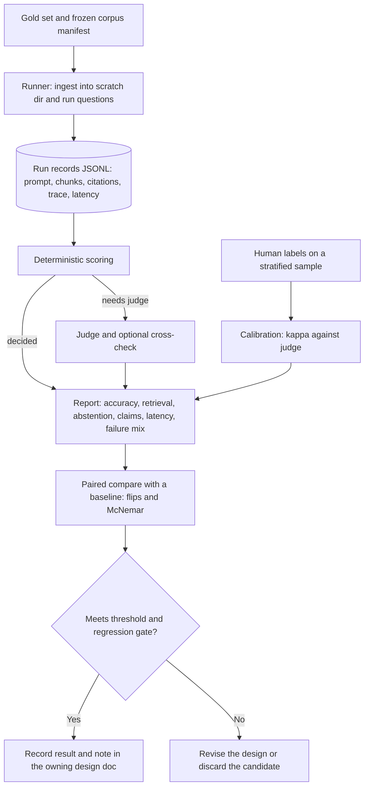
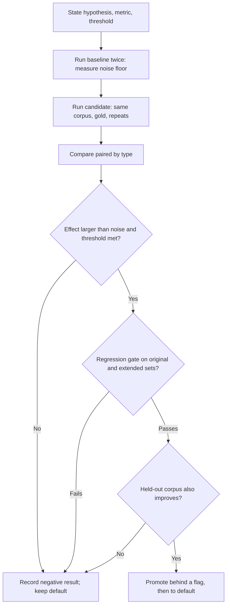

# Evaluation and Benchmarks

Status: Requirements agreed; experiment protocol and gold-set roadmap documented; nothing in this document has been built or run. Three choices were reviewed and decided with the user and are marked **Decided**: gold sets grow by model-drafted items that the user reviews on a stratified sample; the spike-first rule in §4 is mandatory for parts 06 and 07; and a real-document slice is designed here but built later. Everything else is **Recommended (pending validation)**. The audit in §2 was read from `backend/src/docket/eval/` and `backend/eval-public/`; the statistics in §5 and §7 are computed from the formulas the report already uses and should be re-checked by simulation (experiment E8) before they become gates.

Labels used below:

- **Current** describes behavior verified in the repository.
- **Decided** records a choice reviewed with the user.
- **Recommended** is a proposal that has not been measured.
- **Validation gate** marks a threshold that must be met before a default changes or a feature ships.

## 1. Purpose and scope

Parts 01-07 changed how Docket stores, indexes, retrieves, plans and verifies. Every one of them deferred the same question to this part: how do we know a change helped? Two incidents in part 05 show why this cannot stay informal. Two recommended defaults (thinking off, temperature 0) lost correct answers when measured, and the design's central routing step ("send numeric questions to the agent") scored 47.3% against 81.8% for the path it was meant to replace. Both were caught by measurement, not by review.

In scope:

- the audit of the existing evaluation harness and what it cannot yet measure;
- a ledger of every item earlier parts defer to this one;
- the rules for comparing two configurations (paired tests, repeats, noise floor, decision rules);
- the gold-set roadmap, including the sample sizes that the 99% and calibration gates in part 07 actually require;
- the metric set for retrieval, answers, citations, claims, routing, abstention and latency;
- a pre-registered queue of experiments with hypotheses and pass thresholds;
- release gates, regression policy, and calibration and drift handling.

Out of scope:

- model choice and hardware tiers: part 09;
- how results are shown to a user: part 10;
- sequencing across parts: part 11.

## 2. Current implementation (verified against source)

### 2.1 What exists

**Current.** The harness is larger than the README suggests: about 3,500 lines in `backend/src/docket/eval/`.

| Piece | Behavior |
| --- | --- |
| `schema.py` | Pydantic gold set. Question types: `single_fact`, `table_lookup`, `enumeration`, `numeric`, `multi_doc`, `follow_up`, `out_of_corpus`, `revoked`. Gold is verbatim `gold_spans` plus `must_contain` / `must_not_contain` patterns (plain words, digits or `re:` regexes). A `GoldSet` has a `population` field. A 70/30 dev/test split is assigned by hash, and a source document cannot appear in both splits. `RunRecord` stores the exact prompt, retrieved chunks, citations, `model_calls`, `agent_trace`, `latency_s`, the standalone query, scope, ambiguity and the runtime configuration. |
| `runner.py` | Ingests the corpus into a throwaway data dir (never the real one), runs each question through `QueryService` with recording wrappers, and writes JSONL. Modes: auto, fast, agent (forced modes support paired routing comparisons). |
| `scoring.py` | Deterministic pass rule per run: required facts present, no forbidden text, enumeration complete, at least one citation, every cited chunk in the retrieved set, and a cited chunk carrying a gold span. Unanswerable questions pass only by abstaining. Facts a regex cannot settle (plain-word facts) return `NEEDS_JUDGE`. |
| `judge.py` | LLM judge (default `qwen3:30b`, optional cross-check `gemma3:12b`, thinking off, temperature 0, JSON output). Checks paraphrased facts and whether every claim in the answer is supported by its cited text. Deterministic failures stay failures; disagreement counts as doubt. |
| `report.py`, `stats.py` | Question-level accuracy with Wilson 95% intervals, reported two ways (`strict`: needs-judge is not a pass; `optimistic`: it is), pass-all across repeats, slices by type, split, document and formula-dependence, retrieval recall@k, fact-in-context, abstention precision and recall, wrongful abstention, revoked leaks, and a root-cause ladder (`parse`, `retrieval_miss`, `context_truncation`, `generation_error`, `citation_error`, `judge_doubt`, `run_error`). |
| `compare.py` | Paired comparison of two runs with an exact McNemar test and flip counts. |
| `benchmark.py` | `freeze_benchmark` hashes the gold set and corpus bytes into an immutable manifest, so a milestone run can prove its inputs did not move. |
| `calibration.py`, `review.py` | Blind human labelling of a stratified sample of judge verdicts, scored with Cohen's kappa against a 0.7 target. |
| `draft.py` | Drafts questions from sampled chunks; rejects any draft whose quote is not verbatim in the parsed text; drops near-duplicates; a terminal loop reviews them. |
| `formula_review.py` | Human check of unverified formula transcriptions (part 02 provenance). |

**Current.** The accuracy milestone in `report.py` is strict: population must be `real_user_documents`; the test split needs exactly three repeats with reviewed labels, a frozen manifest, a judged result per run with semantic support checks, a recorded single configuration, revoked and out-of-corpus cases, a judge calibration of at least 30 distinct items with kappa at least 0.7 using the same judge models, and a 95% lower bound of at least 90%.

### 2.2 What it cannot yet measure

| Gap | Evidence |
| --- | --- |
| No real-document gold set. Both sets are public or synthetic (`gold.yaml` from `Docs/`, `gold-extended.yaml` from a generated fictional company), so the milestone can never pass as configured. | `population` is `synthetic_public` or `unspecified` |
| The original set is easy and partly duplicated; the extended set was read in detail while designing fixes, so its dev results are optimistic for the fixes that followed. | part 05 §7; README caveats |
| Run-to-run noise of one or two questions on 55, from default answer sampling (temperature 0.6, thinking on), and recent comparisons used one repeat. | part 05 §9, README |
| No latency distribution. `latency_s` is recorded per run but the report prints no p50 or p90, and there is no per-phase timing (route, retrieve, plan, generate, verify). | `report.py` has no latency fields |
| Abstention is detected by exact phrase match, not by a structured field, although `RunRecord.abstained` exists. | `scoring.is_abstention` |
| Citation validity is checked by ID membership; support is checked only by the offline judge. There are no claim-level labels. | `scoring.check_citations`, `judge.py` |
| No routing benchmark (is Fast, Investigate or Clarify the right path), no multi-step set, no prompt-injection or conflict set. | no question types for them in `schema.py` |
| The judge is certified on nothing yet: the 30-item human calibration has not been done. | README |
| No second population to detect over-fitting to the synthetic generator. | one generator, one company |

## 3. What earlier parts defer to this one

Every item below is owned by a section here. Anything not in this table that a later edit defers to part 08 must be added.

| From | Deferred item | Owned in |
| --- | --- | --- |
| 04 §9, §14 | Current splitter against `HybridChunker`; prefix on/off per candidate; deterministic prefix against generated context; ANN index choice | E5, §9 |
| 05 §7 | Reranker default: wider pool on a harder set | E4 |
| 05 §10 | Numeric, multi-document, follow-up, out-of-corpus, scoped-file and ambiguous-period questions before any claim about retrieval | §5 (largely met by the extended set; hardened in G1) |
| 05 §8 | Deterministic compute stage against model arithmetic; seeded agent | E3, G1 |
| 06 §3.4, §10.3 | p50 and p90 latency, route accuracy, task completion, repair frequency, tool use, partial-result honesty, unnecessary clarification | §6, G2 |
| 06 §9 | Category gates for Auto investigation; router benchmark and residency | §9, E3, E6 |
| 07 §10, §13 | Claim gold set, verifier comparison (four configurations), cross-check value, calibration fitting and sample sufficiency, early-abstention threshold calibration | §5, §10, E1, E2, E7 |
| 07 §10.3 | 99% supported-claim precision objective | §5.3 |

## 4. Principles

**Decided (user-reviewed): spike first.** Parts 06 and 07 may not start their infrastructure steps (run tables and plan versions in 06; claim types and the structured-draft path in 07) until the matching experiment in §8 has met its threshold on the gold sets. An experiment is offline: it runs from scripts and recorded run files against scratch data, touches no schema, and can be thrown away. If it fails, the part's implementation sequence is revised before code is written. Part 05 followed this informally and it worked; this makes it a rule.

**Recommended.**

1. **The regression gate stays as it is.** After any chunking, indexing, retrieval, prompt or routing change, run the original set (retrieval recall@8 must stay 33/33, zero wrongful abstentions) and the extended set. A regression on a single gold question is a finding to explain, not noise to average away (part 04 §14).
2. **Compare paired, never by headline.** Two configurations are compared on the same questions with `docket eval compare` (flip counts and exact McNemar). A higher accuracy percentage on its own is never a result.
3. **Measure the noise floor first.** Before any comparison, run the baseline twice and record how many questions flip. A difference smaller than that is not evidence.
4. **Never promote a default on one repeat.** Defaults that change sampling, routing or verification need three repeats (the milestone already requires them).
5. **Report intervals, and abstention as a first-class outcome.** Rates carry Wilson intervals (already built). Wrongful abstention and abstention recall are reported next to accuracy, because a system that refuses everything has perfect precision.
6. **Dev tunes, test confirms.** Fixes are designed against the dev split. The test split (and any held-out corpus from §5.4) is read once per decision, never used to choose between candidates, and is frozen with `freeze_benchmark`.
7. **Eval runs never touch real data.** The runner already ingests into a throwaway data dir. Any new experiment script must set `DOCKET_DATA_DIR` to a scratch directory and the test-suite guard in `tests/conftest.py` stays (see the 2026-10-03 incident).

## 5. Gold-set roadmap

### 5.1 How big is big enough

These figures use the Wilson interval that `report.py` already prints. The lower bound for `k` of `n` correct is computed at 95% confidence; with every item correct it reduces to `n / (n + 3.84)`.

| Goal | What it needs | Today |
| --- | --- | --- |
| Lower bound of at least 90% (the existing milestone) | at least 35 questions all passing, or about 84 with three failures | the public test split has 15 questions; the set as a whole gives 89.6% for 33 of 33, which is just under |
| Detect a change between two configurations with an exact McNemar test (two-sided, p below 0.05) | 6 questions flipping one way with none the other, or 8 to 1, or 10 to 2 | on 55 questions, any net gain under about 8 to 10 questions is indistinguishable from noise when run-to-run flips are already 1-2 |
| 99% supported-claim precision, shown with the same Wilson lower bound | about 381 claims, all supported (about 300 under an exact one-sided bound); each unsupported claim found raises the requirement by hundreds | no claim-level labels exist; 55 questions yield perhaps 150 claims |
| A calibration curve per reporting bucket (part 07 §10.2) | at least 100 held-out observations in each bucket, and the sampling noise of a 10-bin expected-calibration-error estimate at that size is probably comparable to the 0.05 target | not started |

Two consequences follow. First, the current 55-question set can only confirm large effects, which suits the big wins of part 05 and does not suit tuning. Second, the 99% and ECE gates in part 07 are not certifiable with a sample the user can reasonably label, so they stay **Validation gates** reported with their intervals, not release blockers, until E8 shows what the sampling noise really is. The honest claim at release is the interval, for example "claim precision 97% to 100% at 95% confidence on 400 claims," not "99%."

### 5.2 Planned sets

**Decided (user-reviewed): model-drafted, user-reviewed.** New items are generated or drafted by model or script and checked mechanically; the user reviews a stratified sample, not every item. Ground truth stays known by construction wherever possible: derived numeric answers are computed from the generator's data tables, not written by a model, and every gold span must pass the existing verbatim-in-indexed-text check.

| Set | Purpose | Contents | Rough size |
| --- | --- | --- | --- |
| G1 hard numeric | tests arithmetic and unit handling that part 05's numeric tools and part 07's derivation check target | sums and differences across sheets, percentage change, averages over a range with blanks versus zeros, hidden rows, actual versus budget within one year, calendar versus fiscal year, mixed INR and INR-thousands, merged-title-row workbooks, values only on a Notes sheet | about 40, computed |
| G2 multi-step | tests part 06: cross-document comparison, timelines, exhaustive requests, missing or revoked evidence, misleading top hits, ambiguity, deadline-driven partial results | questions that need two or more sources, with a per-step expectation (which documents must be touched, which values read) | about 40 |
| G3 claim-level | tests part 07: each answer's atomic claims labelled `supported`, `unsupported`, `contradicted` or `insufficient` against the cited evidence | built from recorded answers of G1, G2 and the existing sets; claims are extracted by the same prompt as the offline judge, then reviewed | about 400 claims drawn from about 150 answers |
| G4 adversarial | prompt injection in documents, conflicting values across sources, near-duplicate versions, authority conflicts | injected instructions in a workbook note, a memo and a deck; same metric in two files with different values and dates | about 20 |
| G5 routing | tests the Auto router: Fast, Investigate or Clarify is the labelled correct path | questions across all types with a labelled path and reason code | about 80 |

The questions in G1 to G5 are drawn from a second synthetic corpus (§5.4); the existing 55 stay as the regression set.

### 5.3 Labelling workflow

1. A script or model drafts items and gold values; the verbatim and computed-value checks reject malformed items before a human sees them.
2. `docket eval review` shows the user a stratified sample (every type, every expected outcome, every abstention), not the whole set. The review is recorded per item with a `reviewed` flag and a reviewer note.
3. For G3, the user labels a stratified sample of claims blind to any model verdict, using the existing calibration export (`docket eval calibrate`) so that kappa between the automatic verifier and the human is measured with the 0.7 target already in code.
4. A set is usable for a decision only after at least 30 distinct human-labelled items per judge configuration (the existing calibration rule) and a kappa at or above 0.7. Items the human changed are kept as a record of judge error.
5. Effort estimate, to confirm during the first pass: if reviewing a claim takes about a minute, 400 claims is roughly a working day. The stratified-sample design exists so the user labels about 100 to 150 of them and the verifier covers the rest.

### 5.4 Held-out populations

**Recommended.** A second synthetic corpus, from a different generator seed and a deliberately different structure (calendar-year workbooks, different units, different sheet layouts, a merged header on a different sheet, a different company), guards against over-fitting to the first. A fix designed on Tarnwick Provisions that fails on the second corpus did not generalise. The same questions types, the same scoring, and the same frozen-manifest rule apply.

**Decided (user-reviewed): real-document slice designed, built later.** A small slice of the user's own documents, labelled by the user, is the only way to satisfy the existing `real_user_documents` milestone and to say anything about real accuracy. Design constraints, to be built after the synthetic sets: documents stay outside git; the slice is a copy, never the live data directory; the runner already ingests into a throwaway directory; gold files containing real content are kept out of the repository, with only aggregate numbers committed; and the 30-item human calibration and three-repeat rule from §2.1 apply unchanged.

## 6. Metrics

Each metric names its unit, its source in the current code (or the new record field it needs), and what it protects against.

| Area | Metric | Source | Notes |
| --- | --- | --- | --- |
| Retrieval | recall@8 (any gold span, all gold spans), hit@k, rank of first gold chunk (MRR) | `report.py`; MRR and hit@3 exist only in ad hoc experiments and need adding to the report | recall@8 on the original set must stay 33/33 |
| Context | fact-in-context | `report.py` | detects budget drops |
| Answer | strict accuracy, optimistic accuracy, judged accuracy, pass-all across repeats | `report.py` | strict is the working number for dev comparisons |
| Abstention | wrongful abstention, abstention precision and recall | `report.py` | should read a structured `abstained` or answer-status field, not the phrase (see §9) |
| Numbers | numeric exactness: every number in the answer is in the cited cell or a recorded derivation | new, part 07 §5.2 | first spike, E1 |
| Citations | citation validity (existing); claim support (new, G3) | `scoring.py`; part 07 | separate the two in the report |
| Claims | supported-claim precision, unsupported-claim recall, wrongful rejection, coverage | new | all with Wilson intervals |
| Routing | route accuracy per path, unnecessary clarification rate, repair frequency, tool use per run | `agent_trace` already recorded | G5 |
| Partial answers | partial-result honesty: every displayed finding is supported and the missing coverage is stated | new, part 06 §7 | scored by the claim labels |
| Latency | p50 and p90 per question and per phase (route, retrieve, plan, generate, verify) | `latency_s` and `model_calls` are recorded; the report needs percentiles and phase timing in `RunRecord` | thinking answers cost 8-18 s each, so budgets must be summed across phases |
| Resources | peak VRAM, model load and eviction time, tokens per answer | new, part 09 | measured on the target PC |
| Judge | kappa against the human, disagreement rate between judges | `calibration.py` | below 0.7 means judged numbers are provisional |

Latency reporting needs a design note. Parts 06 and 07 each add model calls: a router, a planner, a synthesis call, a claim draft, a semantic verifier (possibly two), and a repair. At the measured 2 to 18 seconds per call, a single question can exceed the 45-second planned stop in part 06 §3.4 unless the calls are budgeted together. The latency table in the report must therefore show both per-phase and end-to-end distributions, and every experiment in §8 reports its latency beside its accuracy.

## 7. Experiment protocol

1. **Fix the question.** Write the hypothesis, the metric, the baseline, and the pass threshold before running. The queue in §8 does this.
2. **Record the configuration.** Every run records its settings (the runner already stores `configuration`) and the commit. Environment overrides use `DOCKET_<NAME>`.
3. **Measure the noise floor.** Run the baseline twice, on the full set, with identical settings; record flips and the count of discordant questions. Use that count as the minimum size of a detectable effect.
4. **Run the candidate** with the same corpus, gold set and number of repeats. Use forced modes when comparing routes.
5. **Compare paired.** `docket eval compare` gives both-pass, only-A, only-B and neither, and the exact McNemar p-value. Report the flips by question type, because an average hides a category that moved.
6. **Decide by rule.** A candidate becomes a default only if it meets its threshold and passes the regression gate (§4). A tie goes to the simpler option, and a regression on any original-set question blocks promotion until explained.
7. **Record the result.** Add the run file and a short note to `backend/eval-public/` (the README already records results through the 81.8% step, with a later 83.6% run not yet written down), and add an "Implemented and measured" note to the owning design document, including negative results and reversals.
8. **Keep experiment code disposable.** An experiment is a script and a recorded run file. It becomes product code only through the owning part's implementation sequence.

## 8. Pre-registered experiments

Each experiment names its owner, hypothesis, metric, pass threshold and rough cost. Thresholds are starting hypotheses; the noise-floor run in §7 can tighten them.

| ID | Owner | Question | Metric and threshold | Cost |
| --- | --- | --- | --- | --- |
| E1 | 07 | Does a deterministic numeric check (every number in the answer must appear in its cited chunk after normalization, or in a recorded derivation) catch real errors without rejecting correct answers? | On recorded extended-set runs: catches at least 3 of the 4 known generation errors, and falsely rejects at most 1 of the correct answers. The rate at which correct derived values are rejected for lacking a derivation record is the main finding. | small: scripts over existing run files |
| E2 | 07 | Do structured atomic claims beat verifying the free-text answer sentence by sentence? | Strict accuracy not lower by more than 2 net questions of 55 and no original-set regression; wrongful abstention not higher; latency per answer reported. Compare against the current citation-label check. | medium: a prompt and a harness |
| E3 | 06 | Does a retrieval-seeded typed plan beat three simpler alternatives: deterministic fan-out (one retrieval per file or fiscal year from the signals), a seeded agent (fast-path chunks in the first turn), and forced fast? | On G2 and the numeric slice: plan validity rate at least 95%; accuracy better than the best alternative by a significant paired margin or by at least 10 points; no regression elsewhere; p50 and p90 latency within the part 06 budget. | medium to large |
| E4 | 05 | Does the reranker help once the pool is wider (30 per leg) and the set harder? | Net gain of at least 3 questions on the extended set with no original-set regression and at most 4 seconds added at p50 on the target PC. Default stays off until met. | medium |
| E5 | 04 | Does `HybridChunker` or a different prefix beat the current splitter on retrieval? | recall@8 and MRR on both sets with no regression on any original-set question. | medium |
| E6 | 06 | Does a separate small router model meet the routing benchmark and fit alongside the main model? | Route accuracy on G5 at or above the deterministic router; end-to-end p50 and p90 not worse; no harmful model eviction. | medium, needs the target PC |
| E7 | 07 | Is the semantic verifier accurate enough against human labels? | Kappa at least 0.7 on at least 30 labelled items per configuration; supported-claim precision and wrongful-rejection rate reported with intervals. | medium, needs G3 |
| E8 | 08 | How noisy are the calibration and 99% gates at the sample sizes we can afford? | A simulation (no model calls) of perfect and slightly miscalibrated verifiers at 100 and 400 observations: report the spread of the 10-bin ECE and the Wilson bound. Sets the real n for the gates. | small, a script |

**Measured (2026-10-05), scripts in `backend/eval-public/experiments/`, run over recorded files with no model calls.**

- **E8, ECE sampling noise.** A perfectly calibrated verifier with high-skewed confidences (10 bins) gave ECE 5-95% ranges of 0.009-0.052 at n=100, 0.005-0.028 at n=400 and 0.003-0.017 at n=1000. A verifier miscalibrated by 0.05 gave 0.020-0.109 at n=100 and 0.029-0.077 at n=400. At n=100 a pass and a fail are indistinguishable, so ECE at or under 0.05 on 100 observations is not a usable gate; n=400 starts to separate them, n=1000 separates them clearly. Part 07's "at least 100 observations" display gate is therefore too low: use at least 400 per bucket, or report the interval and keep `Confidence not calibrated` until then.
- **E1, deterministic numeric check, failed its threshold in both variants.** On `after-period-context-extended-runs.jsonl` (34 correct answered runs, 5 wrong answered runs): the naive check (every number in the answer must appear in the cited chunks) flagged 9 of 34 correct answers (26%) and 2 of 5 wrong ones. Most false rejections were derived values (differences, growth rates, averages), scaled units (210 against 210,000) and fiscal-year fragments (`25`, `26`). A tolerant variant that ignores years and small integers and accepts values reachable by one arithmetic operation over two cited numbers (with unit scaling) flagged 3 of 34 correct answers (multi-step derivations) and 0 of 5 wrong ones, because the permissive closure also explains the wrong values. Conclusion: string and one-step arithmetic matching cannot verify numbers by itself. A check is only decisive for values that are literal cell contents; any derived value needs a recorded derivation from the `calculate` tool (part 05 §8) to be checkable. That moves the weight of part 07 §5.2 onto a deterministic compute stage, and E1's threshold should be restated as "literal values are verified, derived values require a derivation record, and the rate of derived answers without one is measured." The run file is a single repeat, and the five wrong answers are too few for a recall figure; the next run on G1 should be larger.

Order of work: E8 and E1 first (cheap, no model calls beyond existing runs), then G1 (the hard numeric set), then E2 and E3, with E4 to E7 after.

## 9. Release gates and regression policy

**Recommended.**

| Change | Must pass |
| --- | --- |
| Chunking, indexing or retrieval | original set: recall@8 33/33, zero wrongful abstentions; extended set: no net loss beyond the measured noise floor; no new `parse` or `retrieval_miss` failures that the change did not target |
| Prompt, sampling or model | the same, plus three repeats for any default change |
| Routing (part 06) | per-category rule in part 06 §9: beats Fast on that category across repeats, no regression on the 33 and 55 sets, latency distribution met |
| Verification (part 07) | measured supported-claim precision with its interval, wrongful-rejection and coverage reported, no original-set regression, latency within the combined budget |
| Milestone claim ("accuracy at least X on real documents") | the full existing milestone in §2.1, which needs the real-document slice |

Two compatibility changes are prerequisites for part 07 and belong in its implementation sequence: scoring must read a structured abstention field (the answer status and reason code) with the fixed phrase as a fallback, since `scoring.is_abstention` matches the exact phrase and reason-coded abstentions would otherwise read as wrongful answers; and `RunRecord` must record the answer status, claim records, route reason codes and per-phase latency so reports can read them.

**What runs when.** Unit and integration tests on every commit. The original set (about 6 to 8 minutes with thinking on) on any retrieval, chunking or prompt change. The extended set (about 10 to 12 minutes) on the same changes. Three-repeat and judged runs only for a default change or a release. These timings come from part 05 and apply to this machine.

## 10. Calibration and drift

**Recommended.**

- A confidence percentage is shown only with a calibration artifact bound to the answer model, verifier configuration, retrieval and index recipe, answer category, and evaluation set (part 07 §10.2). Any change to one of those invalidates it.
- Report Brier score, a reliability table, and ECE with a confidence interval. Do not treat a point ECE under 0.05 from fewer than a few hundred observations as passing until E8 sets the real spread.
- Until a bucket has enough held-out observations, the interface shows deterministic verification status and coverage, not a percentage. That is already the part 07 default.
- Drift: re-run the frozen original and extended sets on a schedule that follows the model and index recipe (a model upgrade, an index recipe change, a parser change). A change in the failure-category mix is a stronger signal than a change in the headline rate, because the mix says where something moved.
- Record each run's recipe and model identifiers so a result can be tied to the configuration that produced it (the runner already stores configuration and fingerprints).

## 11. Diagrams

### 11.1 Evaluation pipeline

### 11.2 Experiment decision flow

## 12. Remaining implementation-time validation

- **Noise floor on the target PC.** Two identical runs of each set before any E-series comparison; record the discordant count.
- **E8 simulation** for the ECE and 99% sample sizes, before part 07 states either as a gate.
- **Latency percentiles and phase timing.** Add them to `RunRecord` and the report, then measure the combined phase budget that parts 06 and 07 need on the target PC.
- **Structured abstention field in scoring.** Confirm the change leaves the original-set wrongful-abstention count unchanged.
- **Second synthetic corpus.** Check that the extended-set fixes still hold on a structurally different population.
- **Judge calibration.** The 30-item human labelling with the existing tooling, and a claim-level extension for G3.
- **Real-document slice.** Build after the synthetic sets, under the §5.4 constraints.
- **README refresh.** `backend/eval-public/README.md` records results through the 81.8% step; the later 83.6% run should be added.

## 13. Hand-offs

- **Part 06:** G2, G5, E3 and E6, the latency distribution requirement, and the category gate evidence.
- **Part 07:** G3, G4, E1, E2, E7 and E8, the structured abstention field, and the sample sizes behind the precision and calibration objectives.
- **Part 09:** model and VRAM measurements on the target PC; judge, verifier and router models.
- **Part 10:** how results and calibration state are presented.
- **Part 11:** the roadmap order, with spikes before infrastructure.

## References

### Repository evidence

- `backend/src/docket/eval/schema.py`: gold-set and run-record schema, splits, population.
- `backend/src/docket/eval/runner.py`: scratch-dir ingestion, recording wrappers, forced modes.
- `backend/src/docket/eval/scoring.py`: deterministic pass rule, abstention phrase match, citation membership check.
- `backend/src/docket/eval/judge.py`: offline semantic judge and cross-check.
- `backend/src/docket/eval/report.py`, `stats.py`: Wilson intervals, strict and optimistic accuracy, failure ladder, milestone rule.
- `backend/src/docket/eval/compare.py`: paired comparison with exact McNemar.
- `backend/src/docket/eval/benchmark.py`: frozen manifest.
- `backend/src/docket/eval/calibration.py`, `review.py`, `draft.py`, `formula_review.py`: labelling and drafting tools.
- `backend/eval-public/README.md`, `gold.yaml`, `gold-extended.yaml`, `build_synthetic_corpus.py`: current sets, baselines and the synthetic generator.
- `Upgrade/04`, `05`, `06`, `07`: deferred items collected in §3.

### External primary sources

- [Adding Error Bars to Evals: A Statistical Approach to Language Model Evaluations](https://arxiv.org/abs/2411.00640): confidence intervals and paired comparison for eval questions.
- [Judging LLM-as-a-Judge with MT-Bench and Chatbot Arena](https://arxiv.org/abs/2306.05685): judge agreement with humans and judge biases.
- [Ragas: Automated Evaluation of Retrieval Augmented Generation](https://arxiv.org/abs/2309.15217): reference-free RAG metrics for faithfulness and context relevance.
- [Enabling Large Language Models to Generate Text with Citations (ALCE)](https://arxiv.org/abs/2305.14627): citation correctness and completeness evaluation.
- [RAGTruth](https://arxiv.org/abs/2401.00396): annotated unsupported and contradictory RAG output.
- [On Calibration of Modern Neural Networks](https://arxiv.org/abs/1706.04599): expected calibration error, reliability diagrams and their estimation noise.
